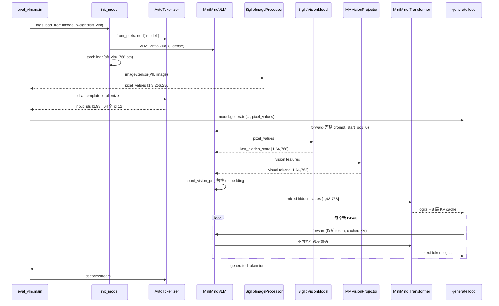
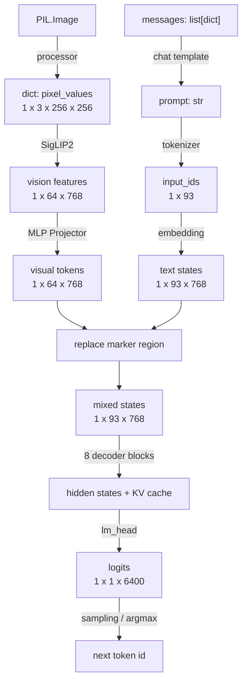
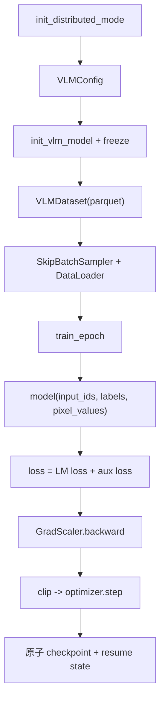

# MiniMind-V 主执行链路追踪

## 1. 选择的最小示例

示例输入：

- 图片：`dataset/eval_images/image-01-golden-dog-balloons.jpg`
- 问题：`<image>\n请描述这张图中的主要物体和场景。`
- 模型：dense `out/sft_vlm_768.pth`
- 设备：NVIDIA GeForce RTX 4060 Laptop GPU

端到端命令：

```powershell
python eval_vlm.py `
  --load_from model `
  --weight sft_vlm `
  --max_new_tokens 12 `
  --image_dir .\dataset\eval_images `
  --show_speed 1 `
  --device cuda
```

该命令会依次处理 `eval_images/` 中 6 张图片。单张精确 trace 使用同一入口、同一模型，只限制为第一张图。

## 2. 主执行链路图



## 3. 从入口逐步追踪

### 步骤 1：解析参数

文件：`eval_vlm.py:35-50`

重要参数：

- `--load_from model`：选择原生 PyTorch 权重路径。
- `--weight sft_vlm`：拼出 `out/sft_vlm_768.pth`。
- `--hidden_size 768`、`--num_hidden_layers 8`：必须和权重一致。
- `--use_moe 0`：选择 dense 权重。
- `--device cuda`：GPU 推理。

隐含假设：`init_model` 在 `eval_vlm.py:17` 使用 `'model' in args.load_from`，不是严格相等判断。包含字符串 `model` 的 Transformers 路径可能误入原生模式。

### 步骤 2：加载 tokenizer、模型和权重

文件：`eval_vlm.py:13-32`

调用链：

```text
init_model
├── AutoTokenizer.from_pretrained("model")
├── VLMConfig(hidden_size=768, num_hidden_layers=8, use_moe=False)
├── MiniMindVLM(config, vision_model_path=...)
│   ├── MiniMindForCausalLM.__init__
│   ├── MiniMindModel.__init__
│   ├── get_vision_model
│   └── MMVisionProjector.__init__
├── torch.load("out/sft_vlm_768.pth")
├── load_state_dict(strict=False)
└── model.half().eval().to(device)
```

数据状态：

- 非视觉 dense 参数实测：65.095M。
- 视觉编码器：94.552M，全部 `requires_grad=False`。
- 总参数约：159.647M。
- 2026-07-13 复测模型构造与原生权重加载约 0.897 秒（本机文件缓存已存在；该值会随磁盘缓存波动）。

`strict=False` 的理由：发布权重故意排除了 `vision_encoder.*`，视觉编码器从独立目录加载。

### 步骤 3：图片预处理

文件：

- `eval_vlm.py:60-64`
- `model/model_vlm.py:73-78`

调用：

```python
image = Image.open(path).convert('RGB')
pixel_values = MiniMindVLM.image2tensor(image, processor)
```

处理配置来自 `preprocessor_config.json`：

- resize 到 `256 x 256`
- rescale 因子 `1/255`
- mean `[0.5,0.5,0.5]`
- std `[0.5,0.5,0.5]`

输出：

```text
pixel_values: float tensor [1,3,256,256]
```

### 步骤 4：构造多模态 prompt

文件：`eval_vlm.py:66-70`

原始 prompt：

```text
<image>\n请描述这张图中的主要物体和场景。
```

替换后：

```text
<|image_pad|> x 64 + \n + 问题
```

chat template 再加入 `<|im_start|>user`、`<|im_end|>`、assistant prefix 和空 think 模板。

实测：

```text
input_ids shape = [1,93]
token id 12 count = 64
```

### 步骤 5：进入自定义 generate

文件：`model/model_minimind.py:255` 附近的 `MiniMindForCausalLM.generate`

每步逻辑：

1. 计算尚未进入 cache 的 input slice。
2. 调用 `forward`。
3. 取最后位置 logits。
4. 应用 repetition penalty、top-k、top-p。
5. 采样或 argmax 得到 next token。
6. 追加 token 与 KV cache。
7. 遇到 EOS 时结束。

注意：`eval_vlm.py` 默认 `do_sample=True`，因此不同随机 seed 可能生成不同文本。组件 trace 使用 `do_sample=False`，确保结果可重复。

### 步骤 6：首次 VLM forward

文件：`model/model_vlm.py:121-194`

#### 6.1 文本 embedding

```python
hidden_states = self.model.dropout(self.model.embed_tokens(input_ids))
```

形状：

```text
[1,93] -> [1,93,768]
```

#### 6.2 视觉编码

条件：`pixel_values is not None and start_pos == 0`。

```text
[1,3,256,256]
  -> SigLIP2 12 层 ViT-B/32
  -> [1,64,768]
```

实测视觉编码加 Projector 约 0.674 秒，首次 GPU 调用包含预热成本。

#### 6.3 Projector

`MMVisionProjector.forward`：

```text
LayerNorm(768)
-> Linear(768,768)
-> GELU
-> Linear(768,768)
```

输出仍是 `[1,64,768]`。

#### 6.4 embedding 替换

文件：`model/model_vlm.py:92-119`

`count_vision_proj` 扫描 id 12 的连续区间，用 visual tokens 替换对应 hidden states。

组件断言：

```text
replacement_ok = True
```

即 marker 位置的融合结果与 Projector 输出在容差内完全一致。

#### 6.5 Transformer

文件：

- `model/model_vlm.py:167-178`
- `model/model_minimind.py:178-232`

混合 hidden states 依次通过 8 个 `MiniMindBlock`：

```text
RMSNorm -> GQA Self-Attention -> Residual
RMSNorm -> SwiGLU FFN -> Residual
```

最后经过 RMSNorm 和 `lm_head`。

单步 trace 使用 `logits_to_keep=1`：

```text
logits shape = [1,1,6400]
KV cache layers = 8
```

完整 prefill forward 实测约 0.136 秒（视觉特征另行提前计算后的测量；端到端 generate 会再次包含视觉编码）。

### 步骤 7：后续 decode

`past_len > 0`，每步只传入新 token：

```python
input_ids[:, past_len:]
```

`MiniMindVLM.forward` 中 `start_pos != 0`，所以跳过视觉编码和 embedding 替换。历史视觉信息已经存在每层 K/V cache 中。

16-token greedy 生成复测（包含视觉编码与 prefill）：

```text
耗时 0.539 秒
约 29.68 token/s
峰值 CUDA allocated memory 约 336.8 MB
输出：这张图片中的主要物体是一只金毛寻回犬，它
```

同一次会话用 CLI 连续处理 6 张图、每张生成 12 token 时，首图为 15.19 token/s，后 5 张为 54.07-59.78 token/s。差异主要来自首轮模型/CUDA 预热和计时边界，因此这些数字只证明闭环可运行，不能替代规范性能测试。

### 步骤 8：输出

CLI 使用 `TextStreamer` 边生成边 decode。最终 `generated_ids` 包含原 prompt 和新 token；速度统计用总长度差得到生成 token 数。

## 4. 数据结构变化总表



## 5. 训练主链路概览

入口：`trainer/train_sft_vlm.py:96`。



训练样本的数据变化：

```text
parquet row
-> conversations JSON + image bytes
-> chat template + 64 image pads
-> fixed-length input_ids / labels
-> processor image dict
-> collate batch
-> VLM forward / loss
```

## 6. 适合打断点的位置

| 目的 | 文件与函数 | 建议检查 |
|---|---|---|
| 看最终 prompt | `eval_vlm.py:68-70` | `inputs_text`、id 12 数量 |
| 看图片 tensor | `model_vlm.image2tensor` | dtype、min/max、shape |
| 看视觉特征 | `get_image_embeddings` | `[B,64,768]`、不同图片是否不同 |
| 看融合 | `count_vision_proj` | marker run、图片数、replacement shape |
| 看首次/后续生成差异 | `MiniMindVLM.forward:133-137` | `start_pos`、是否执行 vision encoder |
| 看 attention | `Attention.forward` | Q/K/V shape、是否走 flash path |
| 看 label mask | `VLMDataset.generate_labels` | supervised token 数与 decode 文本 |
| 看冻结 | `init_vlm_model` | `name, requires_grad` |
| 看训练更新 | `train_epoch` | loss、grad norm、lr、optimizer step 频率 |
| 看续训 | `vlm_checkpoint` | epoch、step、world_size、scaler state |

## 7. 建议加日志的位置

最小调试日志，不应每 batch 永久打印：

```python
print({
    "input_ids": tuple(input_ids.shape),
    "image_markers": int((input_ids == 12).sum()),
    "pixel_values": tuple(pixel_values["pixel_values"].shape),
    "start_pos": start_pos,
})
```

融合后：

```python
print({
    "vision": tuple(vision_tensors.shape),
    "hidden": tuple(hidden_states.shape),
})
```

训练时每个 log interval 额外记录：

- trainable parameter count
- global grad norm
- samples/s
- peak CUDA memory
- DataLoader time 与 compute time

## 8. Profiler 位置

### 粗粒度计时

分别包围：

1. DataLoader 取 batch。
2. `vision_encoder(**image_inputs)`。
3. `vision_proj(...)`。
4. Transformer prefill。
5. 单 token decode。
6. backward 与 optimizer step。

### PyTorch Profiler

在 `train_epoch` 内只 profile 少量 step：

```python
with torch.profiler.profile(
    activities=[
        torch.profiler.ProfilerActivity.CPU,
        torch.profiler.ProfilerActivity.CUDA,
    ],
    record_shapes=True,
    profile_memory=True,
) as prof:
    res = model(input_ids, labels=labels, pixel_values=pixel_values)
```

不要 profile 完整 epoch，否则 trace 本身会造成巨大开销。

## 9. 已验证失败路径

### 从仓库根直接运行训练脚本

命令：

```powershell
python trainer\train_sft_vlm.py --epochs 0 --from_weight none --device cpu
```

结果：失败于 `AutoTokenizer.from_pretrained('../model')`，因为路径相对当前工作目录解析为 `D:\github\model`。

正确方式之一：

```powershell
Set-Location trainer
python train_sft_vlm.py ...
```

更可靠的代码修复：所有默认路径基于 `Path(__file__).resolve()` 计算，而不是依赖 cwd。

### 从 `trainer/` 正确启动但数据缺失

命令：

```powershell
Set-Location trainer
python train_sft_vlm.py --epochs 0 --from_weight none --device cpu
```

模型成功初始化并打印 15.932M 可训练参数，随后失败：

```text
FileNotFoundError: ../dataset/sft_i2t.parquet
```

解决：下载 parquet 到 `dataset/`，或显式传入 `--data_path`。

## 10. 追踪结论

这个项目的“核心算法发生点”不是整个 Transformer，而是三个接口的组合：

1. `get_image_embeddings`：图片转视觉序列。
2. `MMVisionProjector`：视觉空间转 LLM 空间。
3. `count_vision_proj`：把视觉序列放进 LLM 的上下文位置。

此后所有生成能力、KV cache、sampling 和 loss 都来自原有 MiniMind Causal LM。理解这一点，才能把“多模态增量”与“通用语言模型基础设施”分开。
