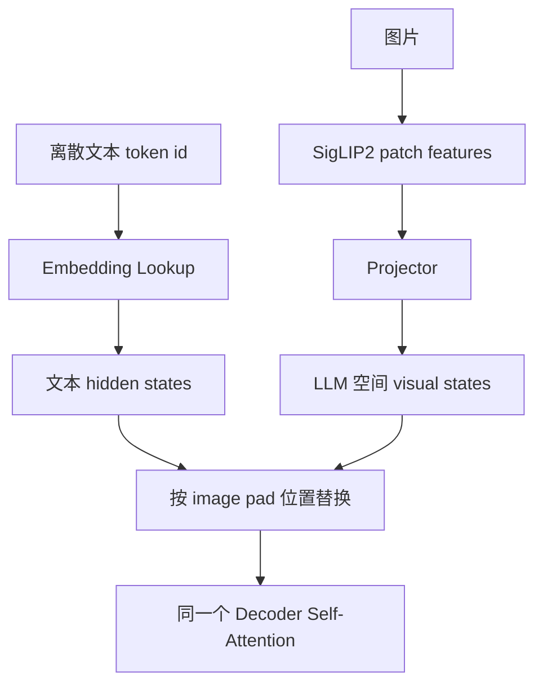
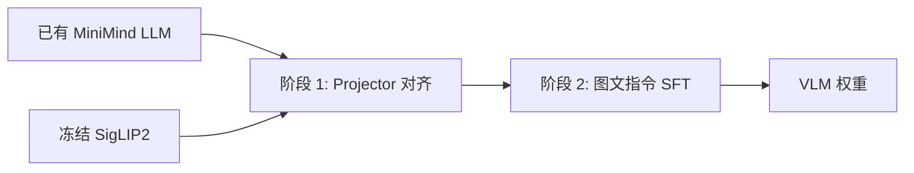
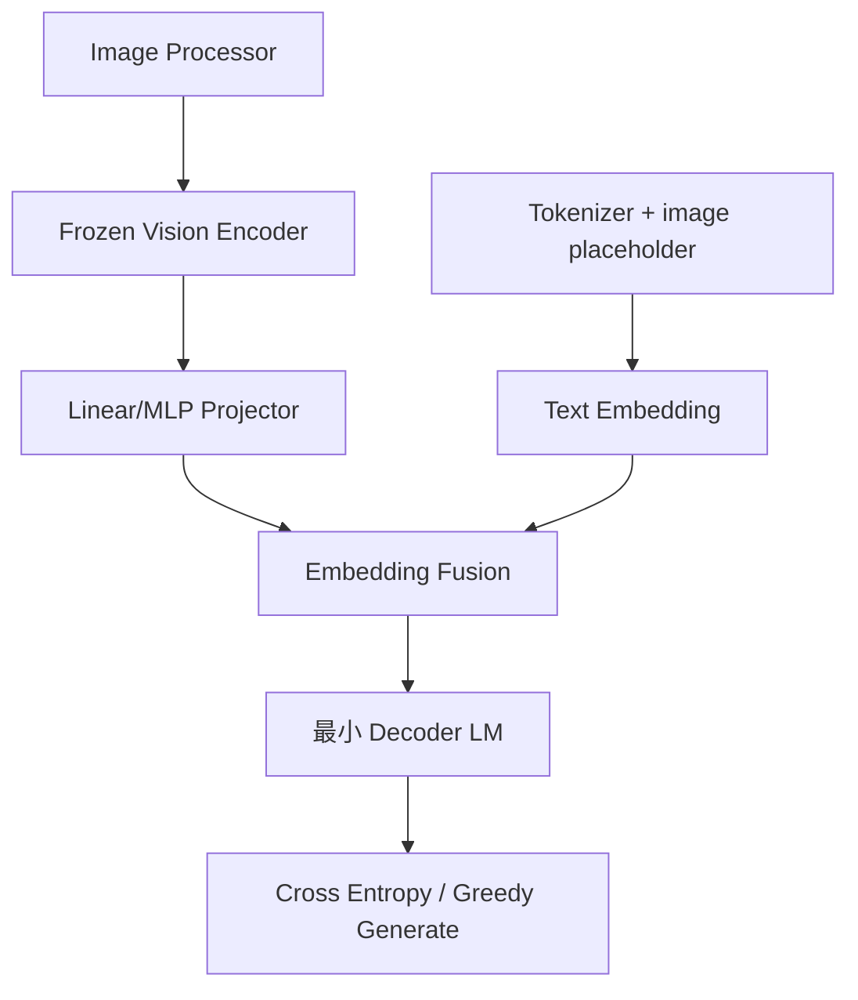

# MiniMind-V 第一性原理

## 1. 不从“VLM”这个名词开始

先忽略 VLM、SigLIP、LLaVA 等名词，只问一个底层问题：

> 已有一个只能接收长度为 `T`、维度为 `d` 的向量序列并预测下一个 token 的模型，怎样让图片也变成这种向量序列？

答案只有两步：

1. 把图片转换为若干个保留视觉信息的向量。
2. 把这些向量转换到语言模型期望的维度和表示空间。

MiniMind-V 的全部多模态增量，就是对这两步的一个极简实现。

## 2. 输入、输出和中间状态

### 输入

推理输入由两部分组成：

- 一张或多张图片：PIL Image，最终处理为 `[B, 3, 256, 256]`。
- 一段文本问题：例如 `<image>\n请描述图片中的主要物体。`

训练输入还包括目标回答，存放在 parquet 的 `conversations` 中。

### 输出

- 推理：token id 序列，解码后是自然语言回答。
- 训练：每个位置的词表 logits `[B,T,6400]`、Causal LM loss，以及 MoE 可选 auxiliary loss。

### 中间状态

一次实测推理中的形状：

| 状态 | 形状 | 产生位置 |
|---|---:|---|
| `pixel_values` | `[1,3,256,256]` | `MiniMindVLM.image2tensor` |
| SigLIP2 patch features | `[1,64,768]` | `get_image_embeddings` |
| projected visual tokens | `[1,64,768]` | `MMVisionProjector` |
| `input_ids` | `[1,93]` | tokenizer；其中 64 个 id 12 |
| mixed hidden states | `[1,93,768]` | `count_vision_proj` |
| 单步 logits | `[1,1,6400]` | `lm_head` |
| KV cache | 8 层 K/V | 每个 Transformer block |

## 3. 图片为什么能变成 token

视觉 Transformer 把图片切成 patch。当前配置：

- 图像高宽：`256 x 256`
- patch size：`32 x 32`
- 每个方向 patch 数：`256 / 32 = 8`
- 总 patch 数：`8 x 8 = 64`

因此：

```math
N_{patch} = \frac{H}{P} \cdot \frac{W}{P} = 8 \cdot 8 = 64
```

SigLIP2 为每个 patch 输出一个 768 维向量：

```math
V \in \mathbb{R}^{B \times 64 \times 768}
```

这里的“视觉 token”不是离散 token id，而是连续向量。它和文本 embedding 的共同点是：最终都是 Transformer 能处理的 hidden state。

## 4. 为什么还需要 Projector

“维度相同”不等于“语义空间相同”。

SigLIP2 的 768 维向量来自视觉对比学习；MiniMind 的 768 维向量来自 next-token prediction。它们坐标轴代表的统计结构不同，不能因为都是 768 维就认为可直接互换。

`MMVisionProjector` 在 `model/model_vlm.py:29` 定义：

```math
Z = W_2\,\mathrm{GELU}(W_1\,\mathrm{LN}(V)+b_1)+b_2
```

其中：

```math
V \in \mathbb{R}^{B\times64\times d_v},\quad
Z \in \mathbb{R}^{B\times64\times d_l}
```

当前 `d_v=d_l=768`。Projector 参数量实测约 1.183M。

设计权衡：

- 单层 Linear 更便宜，但表达能力弱。
- 两层 MLP 比 Linear 多一个非线性，仍然足够简单。
- Q-Former 能压缩和选择视觉信息，但引入额外 attention、query 和训练复杂度。

MiniMind-V 选择 MLP，是“小模型教学闭环”而不是“最强视觉抽取”的优化目标。

## 5. 融合为什么用 embedding 替换

文本中一个 `<image>` 被展开为 64 个 `<|image_pad|>`，tokenizer 配置确认其 id 为 12。先执行普通 embedding lookup：

```math
H_{text}=\mathrm{Embedding}(input\_ids)
```

然后 `count_vision_proj` 找到连续 64 个 id 12，把对应位置替换为 `Z`：

```math
H[:,s:s+64,:] \leftarrow Z
```

融合后的序列示意：

```text
[system/user tokens] [visual_1 ... visual_64] [question tokens] [assistant prefix]
```



为什么不用 cross-attention：

- embedding 替换不需要修改每个 Transformer block。
- 原有 self-attention 自然允许文本位置读取视觉位置。
- 代价是视觉 token 直接增加序列长度，attention 成本随总长度增长。

## 6. 语言模型内部发生什么

### 6.1 Decoder-only Causal LM

模型联合概率分解为：

```math
P(x_{1:T})=\prod_{t=1}^{T}P(x_t\mid x_{<t})
```

视觉 token 不需要成为词表中的输出类别。它们只作为条件上下文，回答仍然从 6400 词表中生成。

### 6.2 Grouped Query Attention

默认：

- query heads：8
- key/value heads：4
- head dim：`768/8=96`

每组两个 query head 共享一组 K/V。`repeat_kv` 在 `model/model_minimind.py:86` 把 K/V 扩展到 query head 数。

普通 attention：

```math
\mathrm{Attention}(Q,K,V)=\mathrm{softmax}\left(\frac{QK^\top}{\sqrt{d_h}}+M\right)V
```

GQA 的目的：减少 KV cache 内存和 K/V 投影参数，同时保留多个 query head 的表达能力。

### 6.3 RoPE

`precompute_freqs_cis` 和 `apply_rotary_pos_emb` 位于 `model/model_minimind.py:62`、`:80`。

本质：对 Q/K 的二维分量施加随位置变化的旋转，使点积包含相对位置信息。它不把位置向量直接加到 token embedding 上。

### 6.4 RMSNorm 与 SwiGLU

RMSNorm：

```math
\mathrm{RMSNorm}(x)=w\odot\frac{x}{\sqrt{\mathrm{mean}(x^2)+\epsilon}}
```

SwiGLU/SILU-gated FFN 在代码中表现为：

```math
\mathrm{FFN}(x)=W_d\left(\mathrm{SiLU}(W_gx)\odot W_ux\right)
```

默认 intermediate size 是 `ceil(768*pi/64)*64 = 2432`。

## 7. Loss 为什么仍然是文本 Cross Entropy

训练目标没有直接要求“视觉特征接近文本特征”。Projector 是通过回答 token 的生成误差间接学习的。

代码在 `model/model_vlm.py:185-191`：

```math
\mathcal{L}_{LM}=-\sum_{t\in A}\log P(y_t\mid x_{<t}, image)
```

`A` 只包含 assistant 回复位置。user、system、padding 位置的 label 为 `-100`，被 PyTorch cross entropy 忽略。

为什么 shift：位置 `t` 的 logits 用来预测 `t+1` 的 token，所以代码使用：

```text
shift_logits = logits[..., :-1, :]
shift_labels = labels[..., 1:]
```

本轮组件测试确认：一个最小样本有 64 个 image marker；示例回答“图中是一只金毛犬。”对应 17 个受监督 token（包含模板自动加入的空 think 段和 `<|im_end|>`）。具体数量随回答和 chat template 变化，但 user、system、padding 位置始终为 `-100`。

## 8. 两阶段训练为什么成立



### 阶段 1：Projector-only

- `freeze_llm=2`
- 实测可训练参数 1.183M
- 高一些的学习率 `4e-4`
- 目的：先让随机 Projector 学到基本图像到语言空间映射

### 阶段 2：Projector + LLM 首尾层

- `freeze_llm=1`
- 实测可训练参数 15.932M
- 低学习率 `5e-6`
- 首层直接接收视觉 token，末层影响回答分布，中间层保留语言能力

### 全量训练

- `freeze_llm=0`
- 实测可训练参数 65.095M
- 视觉编码器仍冻结
- 风险：小 LLM 容易被图文数据覆盖原语言能力

这是一种工程启发式，而不是数学定理。“首尾层最优”需要通过消融实验验证；仓库目前没有提供该消融结果。

## 9. MoE 的第一性原理

Dense FFN 每个 token 都经过同一组参数。MoE 提供多个 expert，由 router 为每个 token 选择少数 expert：

```math
p(e\mid x)=\mathrm{softmax}(W_rx)
```

```math
y=\sum_{e\in TopK(x)}\hat p_e\,Expert_e(x)
```

当前默认 4 个 expert、top-1。实测：

- dense 非视觉参数：65.095M
- MoE 非视觉总参数：199.599M
- 视觉编码器：94.552M

router auxiliary loss 用于避免所有 token 都进入同一个 expert。它衡量 expert 实际负载与平均路由概率的乘积，并乘 `num_experts` 与系数。

## 10. KV Cache 为什么重要

首次生成需要处理完整 prompt：

```text
视觉 token + 问题 token + assistant prefix
```

每层保存已计算的 K/V。下一步只处理新 token，再把新 K/V 追加到 cache。`start_pos` 大于 0 后，`MiniMindVLM.forward` 不再重新编码图片。

没有 KV cache：生成第 `t` 个 token 时重复计算前 `t-1` 个位置。

有 KV cache：历史 K/V 复用，每步只计算一个新 query/key/value。

代价：cache 内存随层数、序列长度、KV heads 和 head dim 线性增长。

## 11. 最稀缺资源与最贵步骤

### 推理

最稀缺资源通常是 GPU 显存与解码时延。

当前实测：

- dense 全模型约 159.647M 参数。
- RTX 4060 Laptop 上的 16-token 单图 greedy 复测峰值分配显存约 336.8MB；另一轮不同预热状态曾记录约 458.8MB。短测数值受 CUDA 缓存和测量边界影响，只适合做环境 sanity check，不应当作正式 benchmark。
- 热身后约 50–58 token/s。

首次请求较慢，因为模型加载、CUDA kernel 初始化与缓存预热。

### 训练

稀缺资源按层级分为：

1. GPU 算力和显存：序列 Transformer forward/backward。
2. 视觉编码计算：编码器虽冻结，但仍每个 batch 前向。
3. 主存：`VLMDataset` 把完整 parquet 装入 Arrow Table。
4. 数据吞吐：JPEG 解码、processor、DataLoader。

可优化方向：预计算冻结视觉特征、流式读取 parquet、混合精度、梯度累积、Flash Attention、DDP。

## 12. 正确性如何验证

最低必要不变量：

1. `<|image_pad|>` 数量必须等于视觉 token 数：当前为 64。
2. Projector 输出最后一维必须等于 LLM hidden size：当前为 768。
3. 替换后序列长度必须符合预期。
4. assistant label 非空；user/system/pad 必须为 `-100`。
5. loss 必须有限，且反向后目标参数有梯度。
6. `freeze_llm` 对应的参数集合必须正确。
7. 首次生成注入视觉，后续 KV cache 步骤不重复视觉编码。
8. 改变图片时输出或内部视觉表示应发生变化。

现仓库缺少的关键测试：

- marker 数与视觉 token 不匹配时应明确报错，而不是静默截断。
- 多图样本的 marker 分组与图片数一致性。
- checkpoint 保存/恢复的一致性。
- dense/MoE forward 与 generation 回归测试。
- 训练路径对当前工作目录的独立性。

## 13. 性能如何衡量

推理指标：

- 首 token 延迟（TTFT）。
- 解码 tokens/s。
- 峰值显存。
- 图片编码耗时与 LLM prefill 耗时。
- 不同 prompt 长度下的吞吐。

训练指标：

- samples/s、tokens/s、step time。
- GPU 利用率、峰值显存、DataLoader wait time。
- loss、aux loss、学习率。
- 每 epoch 总耗时和 checkpoint 时间。

模型质量：

- Caption：CIDEr、BLEU、SPICE 等，但要谨慎解释。
- VQA：准确率或 benchmark 分数。
- 多模态综合：MMBench、MME 等。
- 幻觉：POPE 或对象存在性评估。
- 语言保持：纯文本任务回归。

README 的 6 张样图是 sanity check，不是统计意义上的模型评估。

## 14. 从零实现的最小闭环



必须保留：Vision Encoder、Projector、placeholder、融合、Causal LM、label mask。

先删除：MoE、DDP、SwanLab、WebUI、格式转换、多图、断点续训、复杂 sampling。

当这个最小系统能做到以下三点，就形成了闭环：

1. 一张图片产生固定数量视觉 token。
2. 一条图文样本能产生有限 loss 并更新 Projector。
3. 推理时能输出依赖图片的文本。
