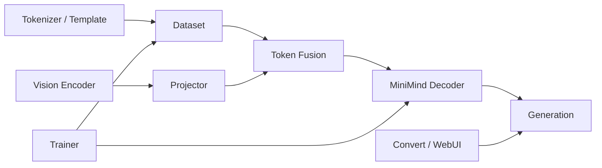

# MiniMind-V 核心模块笔记

## 1. 模块总览

本仓库最重要的 9 个模块：

1. Tokenizer 与 Chat Template
2. 图文 Dataset 与 Label Mask
3. SigLIP2 Vision Encoder
4. MLP Vision Projector
5. 视觉 Token 融合
6. MiniMind Decoder LLM
7. 训练编排与冻结策略
8. 推理与生成
9. 权重转换与 WebUI



## 2. Tokenizer 与 Chat Template

### 职责

- 把文本转为 6400 词表中的 token id。
- 定义 system/user/assistant 边界。
- 定义 `<|image_pad|>` 等多模态特殊 token。
- 统一训练与推理 prompt 格式。

### 暴露接口

```python
AutoTokenizer.from_pretrained("model")
tokenizer.apply_chat_template(...)
tokenizer(text, return_tensors="pt")
tokenizer.decode(...)
```

### 依赖谁

- Hugging Face `PreTrainedTokenizerFast`。
- `model/tokenizer.json` 与 `model/tokenizer_config.json`。

### 谁依赖它

- `VLMDataset` 构造训练 prompt 和 labels。
- `eval_vlm.py` 构造推理 prompt。
- `web_demo_vlm.py` 构造 Web prompt。
- `convert_vlm.py` 保存 Transformers 模型目录。

### 核心数据结构

- `input_ids: LongTensor[B,T]`
- `attention_mask: LongTensor[B,T]`
- `messages: list[dict(role,content)]`

### 隐含假设

- `<|image_pad|>` id 必须和 `VLMConfig.image_ids=[12]` 一致。
- 训练和推理必须使用兼容 chat template。
- assistant 前缀编码必须与 `VLMDataset.bos_id` 的匹配规则一致。

### 常见修改点

- 修改 system prompt 或 thinking 格式。
- 新增特殊 token。
- 支持不同底座 tokenizer。
- 修改多轮 prompt 格式。

### 潜在坑点

- 只改 token 字符串、不更新 id，会导致视觉 embedding 不被替换。
- chat template 变化可能使 `generate_labels` 找不到 assistant 起点。
- tokenizer `model_max_length=131072` 不代表当前模型、显存或训练脚本真能承受该长度。

## 3. 图文 Dataset 与 Label Mask

文件：`dataset/lm_dataset.py`

### 职责

- 读取 parquet 的 `conversations` 与 `image_bytes`。
- 概率添加 system prompt。
- 把每个 `<image>` 展开为 64 个 image pad token。
- 生成固定长度 `input_ids` 和 assistant-only `labels`。
- 将图片 bytes 解码并交给 SigLIP2 processor。

### 暴露接口

```python
VLMDataset(parquet_path, tokenizer, preprocess, max_length, ...)
dataset[index] -> (input_ids, labels, image_data)
```

辅助接口：

- `pre_processing_chat`
- `post_processing_chat`
- `create_chat_prompt`
- `generate_labels`

### 依赖谁

- PyArrow parquet。
- Pillow。
- Tokenizer。
- `MiniMindVLM.image2tensor`。

### 谁依赖它

- Pretrain 与 SFT DataLoader。

### 核心数据结构

```text
conversations: JSON string
image_bytes: bytes | list[bytes]
input_ids: [max_length]
labels: [max_length]
image_data: dict[str, Tensor[num_images,C,H,W]]
```

### 隐含假设

- parquet 必须包含固定列名。
- 每个图片与 prompt 中一个连续 marker run 对应。
- 每个 batch 的图片数量和 processor 字典结构可 stack。
- 所有样本被 pad 到相同 `max_length`。

### 常见修改点

- 改成流式/分片读取。
- 增加数据过滤、图像损坏恢复。
- 动态 padding，降低无效计算。
- 更严格的 marker/image 数量校验。
- 加入多轮、多图或 grounding 数据格式。

### 潜在坑点

- `pa.Table.from_batches(...)` 把全量数据装入内存。
- 图片损坏会在 `Image.open` 直接抛异常。
- 截断可能截掉 assistant 回复，产生全 `-100` labels。
- 随机添加 system 与删除空 think 会影响严格可复现性；需要固定 worker seed。
- 当前没有显式 assertion 保证 supervised token 数大于 0。

## 4. SigLIP2 Vision Encoder

文件：`model/model_vlm.py:57-90`

### 职责

- 把 RGB 图片转换为 64 个 patch hidden states。
- 提供冻结的通用视觉表示。

### 暴露接口

- `MiniMindVLM.get_vision_model`
- `MiniMindVLM.image2tensor`
- `MiniMindVLM.get_image_embeddings`

### 依赖谁

- Transformers `SiglipVisionModel`、`SiglipImageProcessor`。
- 本地 `model/siglip2-base-p32-256-ve/`。

### 谁依赖它

- `MiniMindVLM.forward`。
- Dataset 图片预处理。
- CLI 与 WebUI。

### 核心数据结构

```text
pixel_values: [B,3,256,256]
last_hidden_state: [B,64,768]
```

### 隐含假设

- 图像固定 256x256，patch size 32。
- encoder 输出 token 数与 `image_token_len=64` 一致。
- vision hidden size 与 `image_hidden_size=768` 一致。
- 本地模型文件完整，Transformers 版本兼容。

### 常见修改点

- 换更强视觉编码器。
- 允许动态分辨率。
- 选择中间层而非最后层。
- 预计算视觉特征。
- 解冻最后若干视觉层。

### 潜在坑点

- 换 P16 会从 64 token 变成 256 token，必须同步修改配置和 prompt。
- 冻结参数不等于无计算；每 batch 仍做 vision forward。
- `get_vision_model` 对部分加载异常返回 `(None,None)`，后续可能以不直观方式失败。

## 5. MLP Vision Projector

文件：`model/model_vlm.py:29-42`

### 职责

把视觉 encoder 表示映射到 LLM hidden space。

### 暴露接口

```python
projected = model.vision_proj(vision_features)
```

### 依赖谁

- PyTorch LayerNorm、Linear、GELU。

### 谁依赖它

- `MiniMindVLM.forward`。
- Pretrain/SFT optimizer。

### 核心数据结构

```text
input:  [B,64,768]
output: [B,64,768]
params: 1.183M
```

### 隐含假设

- token 数不在 Projector 内改变。
- `source_tokens`、`target_tokens` 参数当前没有实际参与 forward。

### 常见修改点

- Linear baseline。
- 更深 MLP 或 gated projector。
- token pooling/resampler。
- Q-Former 或 Perceiver Resampler。

### 潜在坑点

- 盲目加深 projector 可能过拟合或增加训练不稳定性。
- 如果输出 token 数改变，融合函数和 placeholder 数都要同步修改。
- 当前 `source_tokens`/`target_tokens` 形参容易让读者误以为存在 resampling。

## 6. 视觉 Token 融合

文件：`model/model_vlm.py:92-119`

### 职责

找到文本 hidden states 中的 image marker 区间，用 visual states 替换。

### 暴露接口

```python
count_vision_proj(tokens, h, vision_tensors, seqlen)
```

### 依赖谁

- `VLMConfig.image_ids`
- tokenizer 特殊 token 约定
- Projector 输出

### 谁依赖它

- `MiniMindVLM.forward`

### 核心数据结构

```text
tokens: [B,T]
h: [B,T,768]
vision_tensors: [B,64,768] 或 [B,N,64,768]
```

### 隐含假设

- marker run 顺序与图片顺序一致。
- 一个 run 对应一张图片。
- marker run 长度和视觉 token 数一致。

### 常见修改点

- 添加严格 shape/assertion。
- 使用 scatter/index_copy，减少 Python loop。
- 支持视觉起止 token。
- 支持动态 token 数和多分辨率。

### 潜在坑点

- 当前长度不一致时可能静默切片，不会立刻报错。
- 每个 batch 用 `.tolist()` 和 Python while，训练编译与性能不理想。
- `@torch.compiler.disable` 明确让该函数退出 compile 图。

## 7. MiniMind Decoder LLM

文件：`model/model_minimind.py`

### 职责

- 处理混合视觉/文本 hidden sequence。
- 计算 Causal Self-Attention 和 FFN/MoE。
- 输出词表 logits、loss 和 KV cache。
- 实现 sampling generation。

### 暴露接口

- `MiniMindForCausalLM.forward`
- `MiniMindForCausalLM.generate`
- `MiniMindModel.forward`

### 依赖谁

- Transformers `PreTrainedModel`、`GenerationMixin`、activation registry。
- PyTorch SDPA/Flash Attention 路径。

### 谁依赖它

- `MiniMindVLM` 继承它并覆盖 forward。

### 核心类

- `MiniMindConfig`
- `RMSNorm`
- `Attention`
- `FeedForward`
- `MOEFeedForward`
- `MiniMindBlock`
- `MiniMindModel`
- `MiniMindForCausalLM`

### 核心数据结构

- hidden states `[B,T,768]`
- Q `[B,8,T,96]`
- K/V `[B,4,T,96]`，计算前重复到 8 heads
- KV cache：每层 `(K,V)` tuple
- logits `[B,T,6400]`

### 隐含假设

- hidden size 能被 attention heads 整除。
- query heads 能被 KV heads 整除。
- RoPE buffer 足够覆盖序列位置。
- weight tying 与 tokenizer vocab size 匹配。

### 常见修改点

- 层数、hidden size、heads、KV heads。
- Flash Attention 开关。
- MoE expert 数和 top-k。
- sampling 策略与 repetition penalty。
- 长上下文 scaling。

### 潜在坑点

- 自定义 generate 不一定覆盖 Hugging Face GenerationMixin 的所有行为。
- attention fallback mask 逻辑需要多 padding/KV 场景测试。
- MoE Python expert loop 可能限制吞吐。
- `logits_to_keep=0` 的 Python slice 语义值得写回归测试。

## 8. 训练编排与冻结策略

文件：

- `trainer/trainer_utils.py`
- `trainer/train_pretrain_vlm.py`
- `trainer/train_sft_vlm.py`

### 职责

- 初始化单卡或 DDP。
- 加载 tokenizer、模型和基础权重。
- 设置冻结参数集合。
- 构造 DataLoader、optimizer、AMP、学习率。
- 梯度累积、裁剪、保存、续训。

### 暴露接口

- `init_vlm_model`
- `vlm_checkpoint`
- `vlm_collate_fn`
- `SkipBatchSampler`
- `train_epoch`

### 依赖谁

- Dataset、VLM、PyTorch optimizer/DDP、SwanLab。

### 谁依赖它

- 两个训练入口；`eval_vlm.py` 复用 seed 和参数统计。

### 隐含假设

- 从 `trainer/` 作为 cwd 启动。
- parquet 与基础权重命名符合约定。
- CUDA DDP 使用 NCCL。
- 每个 rank 数据顺序和续训 step 换算可接受。

### 常见修改点

- 优化器参数组：Projector 与 LLM 用不同 lr。
- warmup + cosine scheduler。
- 动态 padding/bucketing。
- FSDP/DeepSpeed。
- 定期 validation 与 benchmark。

### 潜在坑点

- 默认路径依赖 cwd。
- SFT optimizer 传入所有参数，虽然冻结参数无梯度，但接口不够明确。
- checkpoint 在训练脚本和 `vlm_checkpoint` 中保存两份模型权重，有重复 I/O。
- resume 只换算 step，无法严格保证不同 world size 下样本顺序等价。
- 没有 validation loop 与 early stopping。

## 9. 推理与生成

文件：`eval_vlm.py` 与 `MiniMindForCausalLM.generate`

### 职责

- 加载原生或 Transformers 模型。
- 图片预处理、prompt 构造、批量样图推理。
- top-k/top-p/temperature/repetition penalty sampling。
- TextStreamer 流式输出与速度统计。

### 暴露接口

- `init_model(args)`
- `main()`
- `model.generate(...)`

### 依赖谁

- Tokenizer、VLM、Pillow、模型权重。

### 谁依赖它

- 用户 CLI demo。
- WebUI 使用相同模型 generate。

### 隐含假设

- 原生模型目录参数正好是字符串 `model` 或至少包含它。
- 图片目录可枚举且图片可解码。
- 模型参数与 CLI hidden/layers/MoE 选项一致。

### 常见修改点

- 单图片路径参数。
- batch inference。
- greedy/beam/sampling 切换。
- 输出 JSON、保存结果和 benchmark。

### 潜在坑点

- `'model' in args.load_from` 模式判断过宽。
- 每张图片使用随机 seed，结果不完全可复现。
- 当前只使用固定 prompt。
- 速度计算包含不同程度的首次预热，首图和后续图不可直接平均。

## 10. 权重转换与 WebUI

### 权重转换

职责：注册自定义 config/model，保存 Hugging Face 格式目录，并兼容 Transformers 5 配置变化。

潜在坑点：

- `__main__` 默认转换 MoE，不是 dense。
- 路径硬编码且依赖从 `scripts/` 启动。
- 删除 `vision_encoder` 后，部署仍必须单独提供视觉编码器目录。

### WebUI

职责：扫描模型目录、切换模型、上传图片、线程流式生成。

潜在坑点：

- 只扫描 `.bin`/`.safetensors` Transformers 目录，不扫描原生 `.pth`。
- UI history 没有进入 `chat()` 的 messages，实际是单轮。
- 按字符截断 rendered prompt，不是按 token 截断。
- 全局 `model_lock` 让并发请求串行化。

## 11. 文档/论文到代码映射

| 文档概念 | 代码位置 | 说明 |
|---|---|---|
| LLaVA 视觉指令微调总体范式 | `model_vlm.py` + 两个训练脚本 | 视觉 encoder + projector + LLM |
| LLaVA-1 的线性投影 | 当前无直接实现 | 可作为入门练习替换 MLP |
| LLaVA-1.5 两层 MLP projector | `MMVisionProjector` | 当前 LN + Linear + GELU + Linear |
| 图文两阶段训练 | `train_pretrain_vlm.py`、`train_sft_vlm.py` | Projector 对齐与指令微调 |
| Visual Instruction Tuning | `VLMDataset` + SFT labels | assistant-only next-token loss |
| SigLIP2 patch representation | `get_image_embeddings` | 本项目替换 LLaVA 原 CLIP 视觉塔 |
| 图片占位 token | tokenizer config + `count_vision_proj` | 文档概念落实为 id 12 的连续区间 |
| Causal LM 公式 | `MiniMindForCausalLM.forward` | shift logits/labels + cross entropy |
| GQA / RoPE / MoE | `model_minimind.py` | MiniMind 底座工程实现，不来自 LLaVA 增量 |

本地论文：

- `papers/2304.08485-Visual-Instruction-Tuning-LLaVA.pdf`
- `papers/2310.03744-Improved-Baselines-with-Visual-Instruction-Tuning-LLaVA-1.5.pdf`

MiniMind-V 自身没有独立论文 PDF；README 只提供 GitHub repository citation。

### 文档没写但代码重要的细节

- Projector constructor 的 token 数参数未使用。
- 融合函数被 `torch.compiler.disable` 排除。
- WebUI 不是真多轮。
- 训练默认路径依赖 cwd。
- 全 parquet 内存加载。
- 发布 checkpoint 不含视觉编码器。
- DDP 为避免未使用 Projector 参数加入零值 dummy gradient。

## 12. 三个递进式练习

### 练习 1：入门——可观测的单图 demo

目标：把固定目录批量推理改为可指定单张图片，并打印关键 shape。

修改文件：

- `eval_vlm.py`

建议改动：

- 新增 `--image_path`。
- 当传入时只处理该图片。
- 增加 `--debug_shapes`，打印 input、marker、pixel 和生成长度。
- 固定 `--seed`，替代每图随机 seed。

预期效果：

```powershell
python eval_vlm.py --image_path .\dataset\eval_images\image-01-golden-dog-balloons.jpg --seed 42 --debug_shapes 1
```

如何验证：

- 只输出一张图。
- marker 数为 64。
- 相同 seed、参数和图片生成结果一致。
- 默认参数仍能跑原 6 图 demo。

可能问题：

- argparse 的单图与目录参数优先级。
- sampling 在 GPU 上的严格确定性。
- 调试日志不要污染 streamer 输出。

### 练习 2：中级——严格视觉 token 对齐检查

目标：让 marker/image/token 数不匹配时立刻报可理解错误。

修改文件：

- `model/model_vlm.py`
- 新增 `tests/test_vision_fusion.py`

建议改动：

- 在 `count_vision_proj` 中验证每个样本的 marker run 数等于图片数。
- 每个 run 长度等于 `image_token_len`。
- visual tensor token 维等于 `image_token_len`。
- 错误信息包含 batch index、run 长度、图片数量。

预期效果：

- 合法单图/多图不变。
- 63 或 65 个 image pad 时明确抛 `ValueError`。

如何验证：

- 构造纯 tensor 单元测试，不需要加载视觉 encoder。
- 测试单图成功、多图成功、长度错、图片数错四类情况。

可能问题：

- 当前函数支持静默截断，严格检查属于行为变化。
- padding 中偶然出现 marker id 的理论风险。
- 多图 marker run 的顺序约定需要写进文档。

### 练习 3：高级——预计算视觉特征并做性能对照

目标：视觉编码器冻结时，把图像特征离线缓存，减少训练重复计算。

修改/新增文件：

- 新增 `scripts/precompute_vision_features.py`
- `dataset/lm_dataset.py`
- `model/model_vlm.py`
- 两个训练脚本
- 新增性能测试或 benchmark 脚本

设计：

1. 遍历 parquet 图像，计算 `[64,768]` 特征。
2. 以样本 id/hash 存储特征。
3. Dataset 可选返回 `vision_features` 而不是 `pixel_values`。
4. VLM forward 增加 mutually exclusive 参数，跳过 vision encoder。
5. 比较 samples/s、GPU 利用率、存储占用和 loss 一致性。

预期效果：

- 训练 step 不再执行 SigLIP2 forward。
- 同一 batch 的 projected features 与在线编码在容差内一致。
- samples/s 提升，但磁盘占用和 I/O 增加。

如何验证：

- 在线/离线视觉特征 `allclose`。
- 固定 batch 的 logits/loss `allclose`。
- 记录 100 step 平均 step time 和峰值显存。
- 断点续训与 DDP 均能读取缓存。

可能问题：

- 64x768 的特征缓存可能比 JPEG 大很多。
- float16 缓存存在精度差异。
- 数据增强失效，因为固定图片只缓存一种预处理结果。
- 多进程并发读取与缓存格式设计。

## 13. 面试理解检查题库

正式练习时每次只问一题，不提前看答案。

### 基础架构

1. 为什么 64 个视觉 token 能进入原本只接收文本的 LLM？
2. 维度都是 768，为什么仍需要 Projector？
3. 这个项目和使用 cross-attention 的 VLM 有什么结构差异？

### 主流程

4. 从 `<image>` 到生成第一个 token，依次经过哪些函数？
5. 为什么后续 decode 不重新运行视觉编码器？
6. `labels=-100` 在训练中解决了什么问题？

### 核心模块

7. `count_vision_proj` 有哪些隐含假设？
8. GQA 如何降低 KV cache 成本？
9. MoE auxiliary loss 为什么需要存在？

### 性能与正确性

10. 视觉编码器冻结后为什么仍可能是训练瓶颈？
11. 怎样证明模型不是只依赖文本 prompt、而是真的使用图片？
12. 现有 6 张图片输出能否证明模型质量？为什么？

### 扩展设计

13. 从 P32 改成 P16，需要同步修改哪些模块？
14. 怎样支持动态分辨率而不让 token 数失控？
15. 怎样把 WebUI 改成真正多轮对话？

回答评价标准：

- 是否指出具体文件/函数。
- 是否能说出 shape 或数据结构。
- 是否区分设计动机与代码事实。
- 是否能提出验证方法，而不是只说“应该有效”。
- 是否能说明方案的代价和失败模式。
