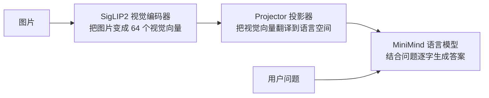
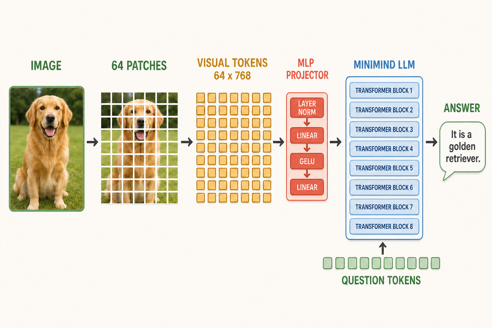
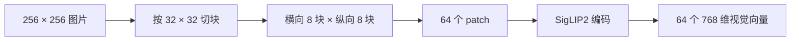
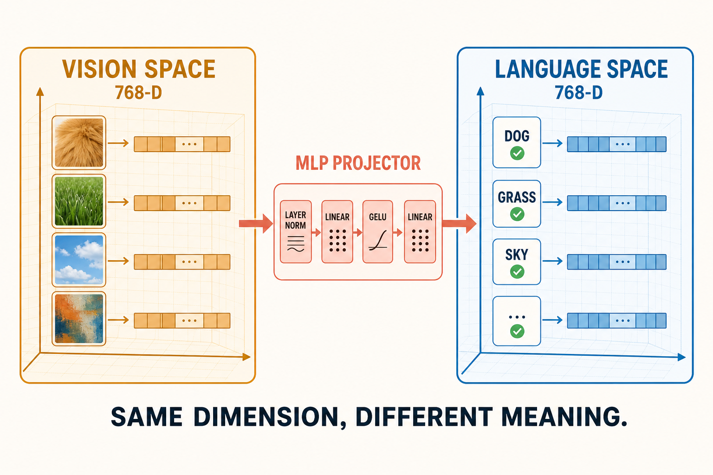
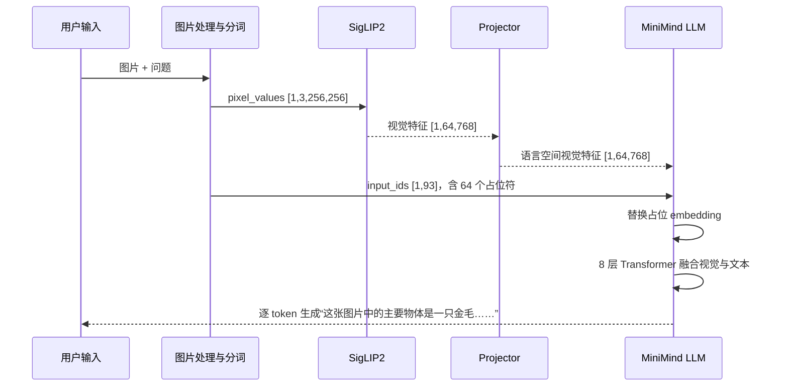
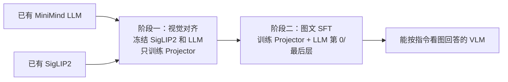
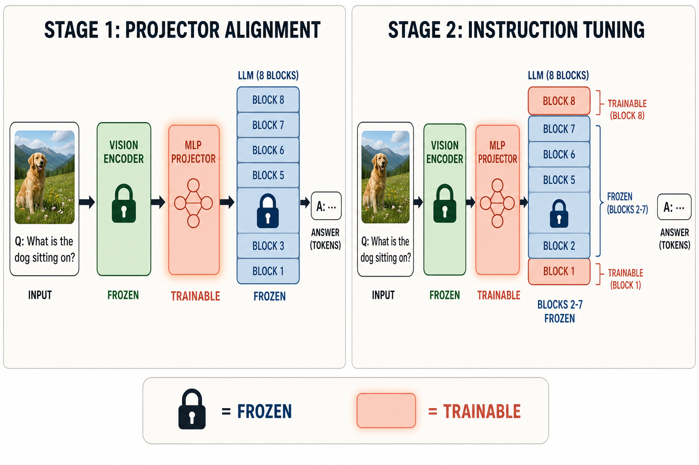

# MiniMind-V 原理与李环老师面试通关讲义

> 适用场景：2026 年 7 月 16 日面试前快速建立完整理解。本文是一份可以独立阅读的统一讲义，不要求你先看其他代码文档。

## 一、先用一句人话理解这个项目

MiniMind-V 做的事情可以压缩成一句话：**先把图片翻译成一串语言模型能够接收的向量，再让语言模型像续写文本一样生成答案。**

语言模型原本不会看图片。它只认识一串 token。Token 可以暂时理解为文字被切分后得到的小单位，例如“金毛犬”可能被切成“金毛”和“犬”，每个 token 再被转换为一个向量。MiniMind-V 的关键想法是：既然语言模型真正处理的不是汉字本身，而是向量，那么只要把图片也变成同样宽度的向量，并放进文字向量序列里，语言模型就能同时处理图像和文字。

这里最容易产生一个误解：模型并没有先把图片识别成“狗、气球、草地”这些文字，再交给语言模型。它传递的是连续向量。向量中保存着图像 patch 的颜色、纹理、形状和语义信息，但不对应词表中的某一个具体词。

整个系统只有三块真正需要先记住：





上图把完整链路压缩成一条视觉故事：图片先被切成 64 个 patch，编码为 64×768 的视觉 token，再经过四步 Projector 和 8 层 MiniMind LLM；问题 token 从下方进入同一个 LLM，最终生成回答。

SigLIP2 是 Vision Encoder，中文叫“视觉编码器”，作用类似眼睛；Projector 中文叫“投影器”或“连接器”，作用类似翻译器；MiniMind LLM 是 Large Language Model，中文叫“大语言模型”，作用类似负责理解上下文和组织回答的大脑。这个比喻并不严格，但非常适合建立第一层理解。

面试时可以先这样概括：

> MiniMind-V 是一个轻量级视觉语言模型。它使用冻结的 SigLIP2 提取图像 patch 特征，通过两层 MLP Projector 把视觉特征映射到 MiniMind LLM 的隐藏空间，然后替换文本序列中 64 个 `<|image_pad|>` 占位符的 embedding。视觉和文本向量进入同一个 decoder-only Transformer，模型仍然通过 next-token prediction 生成回答。

如果这段话暂时有一半不懂，不要背。后面会逐个解释每一个词。

## 二、理解项目之前必须补齐的基础

### 2.1 Tensor、shape 和 hidden size 到底是什么

Tensor 中文叫“张量”，可以先把它理解成多维数字表。一个灰度图像可以表示成二维数字表；彩色图片有红、绿、蓝三个通道，所以通常是三维数字表；同时处理多张图片时再增加 batch 维度。

MiniMind-V 中，预处理后的一张图片形状是：

```text
[1, 3, 256, 256]
```

第一个 `1` 表示 batch size，即一次处理 1 张图；`3` 表示 RGB 三个颜色通道；两个 `256` 表示图片的高和宽。Shape 中文叫“形状”，它说明张量每个维度有多长。

语言模型中的向量宽度叫 hidden size，中文可译为“隐藏维度”。MiniMind 的 hidden size 是 768，意思是每个文本 token 或视觉 token 最终都用 768 个数字表示。768 不是 768 种人为规定的含义，而是模型在训练中自动形成的内部特征坐标。

### 2.2 Token、token id 和 embedding 的区别

Token 是模型处理文本的基本单位；token id 是它在词表中的整数编号；embedding 是根据编号查表得到的向量。三者不能混为一谈。

```text
文字“金毛犬”
    ↓ tokenizer 分词器
token: “金毛” “犬”
    ↓ 查词表
token id: 例如 381、927
    ↓ embedding lookup
两个 768 维向量
```

Tokenizer 中文叫“分词器”。它不仅负责切分文字，还规定 `<|im_start|>`、`<|im_end|>`、`<|image_pad|>` 等特殊 token。MiniMind-V 中 `<|image_pad|>` 的 id 是 12。这个 token 自己不包含图像信息，它只是预留座位，稍后由真正的视觉向量替换。

Embedding 中文常译为“嵌入”。它的本质是一张可学习的查找表。假设词表大小为 6400，hidden size 为 768，那么 embedding 表可以写成：

$$
E \in \mathbb{R}^{6400 \times 768}
$$

输入某个 token id，就是从这张表中取出对应的一行。`\mathbb{R}` 表示实数集合，`6400 \times 768` 表示 6400 行、每行 768 个数。

### 2.3 Linear、GELU、LayerNorm 为什么会一起出现

Linear 中文叫“线性层”或“全连接层”。它对输入向量做矩阵乘法和偏置相加：

$$
y = Wx + b
$$

`x` 是输入，`W` 是可学习权重，`b` 是偏置，`y` 是输出。线性层可以改变向量维度，也可以在维度不变时重新组合信息。

如果神经网络只有线性层，无论叠多少层，最终仍可合并成一次线性变换，表达能力有限。因此需要 activation function，即“激活函数”加入非线性。MiniMind-V 的 Projector 使用 GELU。你不需要背 GELU 的完整公式，只需要知道它会平滑地保留较有用的正响应，并抑制部分负响应，使网络能拟合更复杂的视觉到语言映射。

LayerNorm 中文叫“层归一化”。不同图片产生的特征大小可能差异很大，LayerNorm 会把一个 token 内部的特征调整到相对稳定的尺度，再送入后续线性层。它的作用不是增加知识，而是让训练更稳定。

### 2.4 Softmax、概率和 Cross Entropy

语言模型最后会为词表中的 6400 个 token 各给一个分数，这些未归一化分数叫 logits。Softmax 把 logits 转成和为 1 的概率：

$$
P(i)=\frac{e^{z_i}}{\sum_{j=1}^{V} e^{z_j}}
$$

`z_i` 是第 `i` 个 token 的 logit，`V` 是词表大小。指数函数会放大分数差异，因此高分 token 获得更高概率。

Cross Entropy 中文叫“交叉熵损失”。如果正确答案 token 是 `y`，单个位置的损失是：

$$
\mathcal{L}=-\log P(y)
$$

如果模型给正确 token 的概率是 0.9，损失约为 0.105；如果只给 0.01，损失约为 4.605。训练就是不断调整参数，让正确答案的概率变大、损失变小。

## 三、图片怎样变成 64 个视觉 token

### 3.1 为什么要把图片切成 patch

一张 256×256 的 RGB 图片包含 196,608 个像素值。如果让每个像素直接参与全局注意力，序列太长，计算量很大。Vision Transformer，简称 ViT，中文叫“视觉 Transformer”，会把图片切成固定大小的小块，英文叫 patch。

MiniMind-V 使用的 SigLIP2 输入尺寸是 256×256，patch size 是 32×32。每个方向可以切出：

$$
\frac{256}{32}=8
$$

总 patch 数为：

$$
N_{patch}=8\times8=64
$$

因此一张图最终得到 64 个视觉 token。它们大致对应图片中的 8×8 个空间区域。左上角 patch 和右下角 patch 分别保留不同区域的信息。



视觉 token 与文本 token 的共同点是它们最后都是向量；区别是文本 token 先有离散 id，再查 embedding 表，视觉 token 是视觉编码器直接计算出的连续向量，没有词表 id。

### 3.2 SigLIP2 做了什么

SigLIP2 是预训练视觉模型。Pretrained 中文叫“预训练”，指它在进入 MiniMind-V 项目之前已经通过大量图文数据学到了通用视觉表示。它能提取物体形状、颜色、纹理、场景和语义关系。

SigLIP 的思想与 CLIP 相近，都通过图像和文本之间的对应关系学习表示。区别之一是 SigLIP 使用 sigmoid-based loss，即基于 Sigmoid 的独立配对损失，而经典 CLIP 常使用 batch 内 softmax 对比损失。对 MiniMind-V 面试而言，不需要推导 SigLIP 训练公式；更重要的是讲清它在本项目中只作为视觉特征提取器，而且参数被冻结。

冻结，英文 frozen，表示 `requires_grad=False`。冻结后训练不会更新 SigLIP2 参数，但每个 batch 仍然必须执行一次视觉前向计算。因此“冻结”只节省反向传播的显存和更新成本，不等于视觉编码器没有计算成本。

实际张量变化是：

```text
图片张量                    [1, 3, 256, 256]
SigLIP2 输出                [1, 64, 768]
```

第一个维度是 batch，第二个维度是 64 个 patch，第三个维度是每个 patch 的 768 维表示。

## 四、Projector 为什么是整个多模态连接的关键

### 4.1 维度相同，为什么还要 Projector

SigLIP2 输出 768 维，MiniMind LLM 的 hidden size 也是 768。新手最自然的问题是：维度已经相同，为什么不直接把视觉向量放进 LLM？

原因是**维度相同不代表语义坐标系相同**。可以把它类比成两张同样是 768 列的表：一张表的每列由视觉训练形成，另一张表的每列由文本预测形成。它们列数相同，但数值分布和组合方式不同。就像人民币和日元都用一个数字表示金额，`100` 在两个系统中的含义不同，仍需要汇率转换。

Projector 的任务就是学习这种“视觉空间到语言空间”的转换。MiniMind-V 使用两层 MLP。MLP 是 Multi-Layer Perceptron，中文叫“多层感知机”，在这里就是带非线性激活的全连接网络：

$$
Z=W_2\,\mathrm{GELU}(W_1\,\mathrm{LN}(V)+b_1)+b_2
$$

`V` 是 SigLIP2 特征，`LN` 是 LayerNorm，`W_1`、`W_2` 是两层可学习矩阵，`Z` 是映射后的视觉 token。输入和输出形状都是 `[B,64,768]`，但输出已经被训练成更适合 MiniMind LLM 使用的表示。

Projector 约有 1.183M 可训练参数。计算如下：两层 `768×768` Linear 各包含 `768×768+768=590,592` 个参数，再加 LayerNorm 的缩放和偏置 `2×768=1,536`，总计 1,182,720。

这个数字体现了项目的轻量化思想：不从头训练一个庞大多模态模型，而是保留已有的眼睛和语言大脑，只训练一个较小的翻译器。



图中的左右两边都有 768 个维度，但左边由毛发、草地、天空等视觉统计形成，右边由 DOG、GRASS、SKY 等语言关系形成。Projector 学习的是坐标含义的转换，而不只是修改向量长度。

### 4.2 图像和文字究竟在哪里融合

用户输入通常包含 `<image>`。数据处理会把一个 `<image>` 展开成 64 个连续的 `<|image_pad|>`，因为一张图片恰好对应 64 个视觉 token。

文本先正常查 embedding 表：

$$
H_{text}=\mathrm{Embedding}(input\_ids)
$$

然后模型找到 id 为 12 的连续区间，用 Projector 输出的 64 个视觉向量替换这些位置：

$$
H[:,s:s+64,:]\leftarrow Z
$$

这里 `s` 是图像占位符开始位置。代码中完成这件事的函数叫 `count_vision_proj`。最终序列在概念上变成：

```text
[聊天格式 token] [视觉1] [视觉2] ... [视觉64] [问题 token] [回答起始 token]
```

它在数学意义上相当于把视觉 token 插入序列；在代码实现上是先放 64 个占位符，再替换占位符 embedding。面试时说“拼接”不算完全错误，但最好补一句：“概念上是拼入统一序列，代码上通过替换 `<|image_pad|>` 的 embedding 实现。”

这个设计的优点是无需修改每一层 Transformer，也不需要额外的 cross-attention。Cross-attention 中文叫“交叉注意力”，它让一组 query 专门读取另一组特征。MiniMind-V 选择更简单的 early fusion，即“早期融合”：在进入 LLM 主干前就把视觉和文本变成同一种 hidden state，后续全部交给原有 self-attention。

## 五、语言模型怎样把视觉和问题变成答案

### 5.1 Decoder-only 和自回归生成

MiniMind 是 decoder-only Transformer。Decoder-only 指只使用 Transformer 解码器结构，按照从左到右的顺序预测下一个 token。GPT、LLaMA 都属于这一类。

模型把一段序列的联合概率拆成：

$$
P(x_{1:T})=\prod_{t=1}^{T}P(x_t\mid x_{<t})
$$

`x_{<t}` 表示位置 `t` 之前的全部内容。加入图片以后，这个目标没有改变，只是“之前的内容”中多了 64 个视觉向量。模型仍然在做 next-token prediction，即“下一个 token 预测”。

### 5.2 Self-Attention 到底在算什么

Self-Attention 中文叫“自注意力”。它解决的问题是：当前 token 应该从前面的哪些 token 中读取信息？

每个输入向量会经过三组线性变换，得到 Query、Key、Value，简称 Q、K、V：

$$
Q=XW_Q,\quad K=XW_K,\quad V=XW_V
$$

Query 可以理解成“我现在需要找什么”；Key 是“我能提供什么索引”；Value 是“我真正携带的内容”。注意力公式是：

$$
\mathrm{Attention}(Q,K,V)=\mathrm{softmax}\left(\frac{QK^\top}{\sqrt{d_h}}+M\right)V
$$

`QK^T` 计算 query 与所有 key 的相似度；除以 `\sqrt{d_h}` 防止维度大时数值过大；`M` 是 mask，即“遮罩”；Softmax 得到权重；最后用权重加权 Value。

例如模型正在生成“犬”，当前 token 的 Query 可能对表示狗头、毛发和用户问题“主要物体”的视觉/文本 Key 得分较高，于是从这些位置读取更多 Value。模型不是调用一个显式的“识狗函数”，而是通过大量层的注意力和前馈网络逐步组合证据。

### 5.3 Causal Mask 为什么必不可少

Causal 中文叫“因果的”。Causal Mask 规定位置 `t` 只能看见自己和之前的位置，不能偷看未来正确答案。它通常把未来位置的注意力分数设为负无穷，经过 Softmax 后概率变为 0。

如果训练时可以看到未来 token，模型会直接抄答案，训练损失虽然很低，真正生成时却无法工作。因此 causal mask 保证训练和推理遵守相同的从左到右信息边界。

### 5.4 GQA、RoPE、RMSNorm 和 SwiGLU

MiniMind 默认有 8 个 Query head、4 个 Key/Value head。Head 中文叫“注意力头”，不同 head 可以学习不同关系。GQA 是 Grouped Query Attention，中文叫“分组查询注意力”：多个 Query head 共享同一组 K/V。这里每两个 Query head 共享一组 K/V。相对 8 个完整 K/V head，它减少了 K/V 投影和 KV cache 占用，同时保留 8 种查询方式。

RoPE 是 Rotary Position Embedding，中文叫“旋转位置编码”。Self-Attention 本身不知道 token 顺序。RoPE 根据位置旋转 Q 和 K 的二维分量，使它们的点积同时包含内容关系和相对位置信息。你不需要在面试中推导复数旋转，但要能回答：RoPE 作用在 Q/K 上，用旋转方式注入位置，便于模型感知相对距离。

RMSNorm 是 Root Mean Square Normalization，中文可称“均方根归一化”：

$$
\mathrm{RMSNorm}(x)=w\odot\frac{x}{\sqrt{\mathrm{mean}(x^2)+\epsilon}}
$$

它稳定特征尺度，比 LayerNorm 少计算均值。SwiGLU 是带门控的前馈网络：

$$
\mathrm{FFN}(x)=W_d\left(\mathrm{SiLU}(W_gx)\odot W_ux\right)
$$

这里的 FFN 是 Feed-Forward Network，中文叫“前馈网络”。可以把门控理解为模型根据输入决定哪些中间特征应通过。它们都是现代 LLM 常用组件，但不是 MiniMind-V 多模态创新的核心。面试回答时应先讲 Vision Encoder、Projector 和 embedding 替换，再补这些底座细节。

### 5.5 MoE 是可选项，不要一开始陷进去

MoE 是 Mixture of Experts，中文叫“混合专家”。它把一个 FFN 换成多个 expert，由 router 为每个 token 选择少数 expert：

$$
p(e\mid x)=\mathrm{softmax}(W_rx),\qquad
y=\sum_{e\in TopK(x)}\hat p_e Expert_e(x)
$$

它可以增加总参数量而不让每个 token 激活全部参数，但会引入路由均衡和通信问题。MiniMind-V 有 dense 和 MoE 两版。明天面试先把 dense 主链路讲清，只有被追问时再解释 MoE。

## 六、把一张图片问答从头走到尾

现在用真实例子把前面的零件串起来。输入是一张金毛犬和气球的图片，问题是“请描述这张图中的主要物体和场景。”



第一步，图片处理器把 PIL 图片缩放和归一化为 `[1,3,256,256]`。归一化就是把像素值调整到模型训练时熟悉的范围。

第二步，SigLIP2 把图片切成 64 个 patch 并编码，得到 `[1,64,768]`。Projector 再做视觉空间到语言空间的转换，形状仍为 `[1,64,768]`。

第三步，问题中的 `<image>` 被替换为 64 个 `<|image_pad|>`。加入聊天模板后，实测 `input_ids` 形状为 `[1,93]`，其中恰好 64 个 id 等于 12。查 embedding 后得到 `[1,93,768]`。

第四步，`count_vision_proj` 用 Projector 输出替换 64 个占位位置。序列长度仍是 93，但其中 64 个位置已经不是普通文本 embedding，而是真实视觉特征。

第五步，混合序列进入 8 层 MiniMind Transformer。每一层通过注意力让问题和回答位置读取相关视觉位置，再经过 FFN 变换。最后 LM Head，也就是“语言模型输出层”，把 768 维 hidden state 映射成 6400 个词表 logits。

第六步，模型选择下一个 token，把它接到序列末尾，然后重复预测，直到遇到 EOS 或长度上限。EOS 是 End of Sequence，中文叫“序列结束标记”。实测 16-token greedy 输出是“这张图片中的主要物体是一只金毛寻回犬，它”。Greedy 中文叫“贪心解码”，即每次都选概率最大的 token。

你应该能在纸上写出这条 shape 链：

| 阶段 | Shape | 含义 |
|---|---:|---|
| 图片输入 | `[1,3,256,256]` | 1 张 RGB 图片 |
| SigLIP2 输出 | `[1,64,768]` | 64 个 patch 特征 |
| Projector 输出 | `[1,64,768]` | 64 个语言空间视觉 token |
| 文本 id | `[1,93]` | 含 64 个 id=12 |
| 融合 hidden state | `[1,93,768]` | 视觉和文本统一序列 |
| 单步 logits | `[1,1,6400]` | 下一个 token 的词表分数 |
| KV cache | 8 层 K/V | 保存历史注意力信息 |

只要这张表能够脱稿讲清，你就已经掌握了项目主流程。

## 七、模型是怎样训练会看图的

### 7.1 训练数据长什么样

每条训练数据至少包含图片和对话。对话可以简化为：

```text
user: <image>\n这张图里有什么？
assistant: 图中有一只金毛犬和一些气球。
```

数据集代码会把 `<image>` 展开成 64 个 `<|image_pad|>`，用 chat template 加上 user/assistant 边界，再分词成固定长度的 `input_ids`。

Chat template 中文叫“聊天模板”，作用是用统一格式告诉模型哪一段是用户、哪一段是助手。训练和推理必须使用兼容模板，否则模型训练时学到的边界与推理时看到的边界不同。

### 7.2 为什么只监督 assistant 回答

训练目标不是让模型背诵用户问题，而是让它根据图片和问题生成回答。因此 labels 中只有 assistant 回答位置保留正确 token，用户、系统提示、图片占位和 padding 位置都设成 `-100`。

PyTorch Cross Entropy 把 `-100` 当作 ignore index，即“忽略位置”。完整损失可以写成：

$$
\mathcal{L}_{LM}=-\frac{1}{|A|}\sum_{t\in A}
\log\frac{\exp(z_{t,y_t})}{\sum_{v=1}^{V}\exp(z_{t,v})}
$$

`A` 是 assistant token 的位置集合，`y_t` 是正确 token，`z_{t,v}` 是位置 `t` 对词表 token `v` 的 logit。这个公式的直觉是：只在助手应该说话的地方惩罚模型，并提高正确回答 token 的概率。

代码还会执行 shift：位置 `t` 的 logits 预测位置 `t+1` 的 token，因此使用 `logits[:-1]` 对齐 `labels[1:]`。这是自回归语言模型的基本训练方式。

### 7.3 为什么分成 Projector Pretrain 和 SFT

Projector 初始是随机的。如果一开始就同时更新 Projector 和大量 LLM 参数，错误视觉信号可能扰乱原有语言能力。MiniMind-V 采用两阶段训练。





左图表示阶段一只训练 Projector，视觉编码器和全部 8 个 LLM block 冻结；右图表示阶段二继续训练 Projector，并开放第 1 和第 8 个 block，中间第 2 至第 7 个 block 仍冻结。代码按从 0 开始编号，因此源码中的第 0 层就是图中的 BLOCK 1。

第一阶段常称 Pretrain，但这里不是从零预训练整个模型，而是 projector-only alignment，即“只训练连接器的视觉语言对齐”。输入通常是图片描述数据。损失仍然是文本生成损失，并没有单独计算“视觉向量与文本向量的距离”。Projector 通过回答是否正确间接学会映射。

第二阶段是 SFT。SFT 是 Supervised Fine-Tuning，中文叫“监督微调”。模型使用更丰富的图片问答和指令数据，学习如何遵循用户要求。默认训练 Projector 以及 LLM 的第 0 层和最后一层 Transformer block，其他 LLM 层和视觉编码器冻结。

为什么选择首尾层？第 0 层最早接触混合视觉/文本表示，最后一层接近输出分布，因此调整它们是一种低成本折中。但这只是工程启发式，不是数学定理。要证明它优于训练其他层，必须做消融实验。Ablation study 中文叫“消融实验”，即只改变一个设计，比较它是否真正有贡献。

三种冻结模式的实测可训练参数为：Projector-only 约 1.183M；Projector 加首尾 Transformer 层约 15.932M；除视觉编码器外全部训练约 65.095M。视觉编码器本身约 94.552M，始终冻结。

### 7.4 反向传播到底更新了什么

Forward pass 中文叫“前向传播”，即输入经过模型得到 logits 和 loss。Backward pass 中文叫“反向传播”，它根据链式法则计算 loss 对每个可训练参数的梯度：

$$
\theta\leftarrow\theta-\eta\nabla_\theta\mathcal{L}
$$

`\theta` 是参数，`\eta` 是 learning rate，即“学习率”，`\nabla_\theta\mathcal{L}` 是梯度。冻结参数即使参与前向计算，也不会被优化器更新。

Gradient accumulation 中文叫“梯度累积”。显存不足时，可以连续计算几个小 batch 的梯度，再统一更新一次，模拟更大 batch。Mixed precision 中文叫“混合精度”，使用 fp16 或 bf16 降低显存和加速计算。Gradient clipping 中文叫“梯度裁剪”，限制梯度范数，避免训练突然发散。这些是训练工程手段，不改变模型的基本目标。

### 7.5 数据质量为什么可能比模型结构更重要

图文对齐项目中，如果图片与回答错配，Projector 会被迫学习错误关联；如果答案大量模板化，模型会只学会固定句式；如果图片重复，训练 loss 下降不代表泛化；如果回答包含事实幻觉，模型会把幻觉当成正确标签。

从 data-centric AI，即“以数据为中心的人工智能”视角，应该检查图文一致性、重复率、图片损坏、回答长度分布、问题类型分布、训练/测试泄漏和难例覆盖。模型结构不变，仅通过清洗和选择数据也可能显著改善效果。这一点与李环老师公开强调的数据准备和数据质量方向直接相关。

## 八、推理时为什么需要 Prefill、Decode 和 KV Cache

### 8.1 Prefill 与 Decode

Inference 中文叫“推理”，指训练完成后用模型生成答案。生成过程分为两个阶段。

Prefill 中文常叫“预填充”。模型一次处理完整输入，包括 64 个视觉 token、问题和聊天模板，并为每层计算历史 K/V。MiniMind-V 的第一步输入长度实测为 93。

Decode 中文叫“解码”。Prefill 后每次只输入一个新 token，预测下一个 token，再循环。Decode 是严格自回归的，后一个 token 依赖前一个结果，所以难以一次并行生成全部答案。


### 8.2 KV Cache 为什么能加速

KV Cache 中文叫“键值缓存”。Self-Attention 中，历史 token 的 K/V 在生成后不会变化。如果每生成一个 token 都重新计算完整历史，会大量重复。KV cache 把每层历史 K/V 保存下来，下一步只计算新 token 的 Q/K/V，再把新 K/V 追加进去。

它用显存换计算。近似内存公式是：

$$
M_{KV}=2\times L\times T\times H_{kv}\times d_h\times bytes
$$

前面的 `2` 表示 K 和 V；`L` 是层数；`T` 是缓存序列长度；`H_{kv}` 是 KV head 数；`d_h` 是每个 head 的维度；`bytes` 是每个数的字节数。

MiniMind dense 配置中 `L=8`、`H_{kv}=4`、`d_h=96`。若 `T=93` 且 fp16 每个数 2 字节，单样本 KV cache 约为 1.09 MiB；1 MiB 等于 1,048,576 字节。64 个视觉 token 单独贡献约 0.75 MiB。对这个小模型不大，但在几十层、几十个 head、几千个视频 token 的大模型中会快速增长。

### 8.3 视觉 token 为什么会拖慢多模态模型

Self-Attention 对长度 `T` 的 prefill 计算大致随 `T^2` 增长，因为每个 query 都要与许多 key 比较。图片分辨率越高、视频帧越多，视觉 token 越多，prefill 越慢。KV cache 则随 `T` 线性增长，视觉 token 会长期占据显存。

Decode 阶段每步虽然只处理一个新 token，但要读取历史 KV cache，大模型常受 memory bandwidth，即“显存带宽”限制，而不是纯算力限制。显存带宽表示单位时间能从 GPU 显存搬运多少数据。

这正是高效多模态推理研究关注视觉 token 压缩、KV cache 压缩和 speculative decoding 的原因。

### 8.4 Temperature、Top-p 和 Greedy

Greedy decoding 每步选择概率最高 token，结果稳定，但可能重复或保守。Temperature 中文叫“温度”，对 logits 做缩放：

$$
P(i)=\mathrm{softmax}(z_i/\tau)
$$

温度 `\tau` 越低，分布越尖锐；越高，输出越随机。Top-p 又叫 nucleus sampling，即“核采样”，先选择累计概率达到 `p` 的最小 token 集合，再从其中采样。调试和比较模型时应使用 greedy 或固定随机种子；面向用户生成时可以适度采样。

## 九、怎样证明模型真的会看图

六张样图能生成“金毛犬、雨伞、汽车”，只能说明链路基本接通，不能证明模型质量优秀。正确性验证至少要区分组件正确、模型是否使用视觉、任务质量和效率。

组件层面要检查 shape、64 个占位符是否全部替换、Projector 是否有梯度、冻结参数是否不更新、loss 是否有限、checkpoint 能否正确恢复。

要证明模型真的使用图片，可以做 counterfactual test，即“反事实测试”：保持问题不变，只替换图片，看回答是否相应改变；把视觉特征置零或打乱，看性能是否下降；使用两张只有细节不同的图片，检查模型能否区分。如果换图后答案完全不变，模型可能只依赖语言先验。

质量评估应使用独立测试集。图片描述可看 CIDEr、SPICE 等指标，但自动指标不能完全代表事实正确性；VQA 可看准确率；综合能力可看 MME、MMBench、MMMU；幻觉可使用 POPE 一类对象存在性测试。还应测试纯文本能力是否因多模态微调而退化。

效率评估不能只报一次 token/s。应固定 GPU、dtype、batch、输入长度、输出长度和解码策略，先 warmup，再分别报告 prefill latency、time to first token、decode tokens/s、峰值显存和多轮均值。Latency 是“单次延迟”，throughput 是“单位时间吞吐量”，两者不是同一个指标。

## 十、针对李环老师研究方向应该怎样理解这个项目

根据浙江大学官方主页和李环老师个人主页，其公开研究主线是 data-centric、resource-efficient、scalable AI，也就是“以数据为中心、资源高效、可扩展的人工智能”。近期明确包含大模型和多模态大模型高效推理、模型轻量化、数据准备和多模态数据。下面的面试题是根据这些公开方向做的高概率预测，不是对真实题目的保证。

MiniMind-V 与该方向的连接点很清楚。它本身就是一个资源受限条件下的 VLM 最小闭环：冻结 94.552M 的视觉编码器，先只训练 1.183M Projector，SFT 时只开放少量 LLM 层；语言主干使用 GQA 减少 KV cache；图片固定为 64 个 token，避免高分辨率带来的序列爆炸。

但它离真正的高效系统还有距离。训练时即使 SigLIP2 冻结，每个 epoch 仍反复编码相同图片；所有样本 padding 到固定长度，浪费计算；视觉 token 不根据问题动态选择；生成仍逐 token 自回归；没有量化、批处理调度、KV 压缩或推测解码；数据集一次装进 Arrow Table，大数据下也可能有主存压力。

如果老师问你“这个项目还能怎么做”，不要只说“换更大模型”。更贴合其方向的回答是：先测量瓶颈，再针对瓶颈优化。训练侧可以预计算冻结视觉特征、动态 padding、用 LoRA 或分层学习率，并从数据质量角度做错配清洗、去重和难例选择。推理侧可以减少视觉 token、压缩 KV cache、量化权重，并用 speculative decoding 降低自回归串行开销。

LoRA 是 Low-Rank Adaptation，中文叫“低秩适配”。它不直接更新大矩阵 `W`，而学习一个低秩增量：

$$
W'=W+BA
$$

若原矩阵是 `d_{out}×d_{in}`，而秩 `r` 很小，新增参数从 `d_{out}d_{in}` 降到 `r(d_{in}+d_{out})`。它节省训练参数和优化器状态，但不一定自动提高推理速度，因为推理时仍需执行原大矩阵。

Quantization 中文叫“量化”，把 fp16/fp32 权重改用 int8、int4 等低比特表示，减少模型大小和显存带宽。代价是量化误差，尤其视觉 Projector、激活异常值或小模型可能更敏感，需要校准和精度评估。

Visual token pruning 中文叫“视觉 token 裁剪”，即删除与问题关系较弱或高度重复的视觉 token。它能同时减少 prefill 计算和 KV cache，但可能误删小物体、文字或细粒度证据。合理方案应动态考虑问题，而不是永远保留固定区域，并通过反事实和细粒度 benchmark 验证损失。

Speculative decoding 中文叫“推测解码”。快速 draft model 先提出多个候选 token，target model 用一次并行前向验证它们；符合目标分布的候选被接受，不符合的回退重采样。在严格验证规则下可以做到 lossless，即“输出分布无损”，但实际加速取决于 draft 速度、接受率和验证开销。

李环老师团队的 ACL 2024 `Draft & Verify` 使用跳过中间层的同一个模型做 self-speculative decoding，不需要额外 draft model，论文报告最高 1.99×；EMNLP 2025 `SpecVLM` 面向 Video-LLM，用 verifier 引导的视觉 token 裁剪加速 draft，论文报告最高 2.68×。你不需要假装精读过全部论文，但应该能说出它们与 MiniMind-V 的连接：**MiniMind-V 展示了视觉 token 如何进入自回归 LLM，而高效推理研究继续追问这些视觉 token 和逐 token 解码能否在保证质量的前提下变得更少、更快。**

## 十一、明天最可能遇到的专业问题与可口述答案

下面的答案按“先给结论，再解释原因，最后说明边界”组织。面试时不要一口气背完；先说前两三句，老师继续追问再展开。

### Q1：请你用两分钟介绍这个项目

> 我参与的是一个轻量级视觉语言模型 MiniMind-V。核心目标是用较低训练成本，让已有 MiniMind 语言模型获得基础看图问答能力。模型用冻结的 SigLIP2 把 256×256 图片切成 64 个 patch，并输出 64×768 的视觉特征；两层 MLP Projector 把这些特征映射到 MiniMind 的 768 维隐藏空间；代码再用它们替换 prompt 中 64 个 `<|image_pad|>` 的 embedding。后续由同一个 decoder-only Transformer 通过 self-attention 融合图片和问题，并自回归生成回答。
>
> 训练分两阶段：先冻结视觉编码器和 LLM，只训练约 1.183M 的 Projector；再训练 Projector 和 LLM 首尾 Transformer 层做图文指令微调。我主要完成了推理链路验证、核心张量和冻结策略检查，并从效率角度分析了视觉 token、KV cache 和自回归解码瓶颈。当前跑通了 6 张样图推理，但没有完整重训和标准 benchmark，所以我不会把 demo 描述成正式性能结果。

### Q2：为什么图片可以进入只处理文本的语言模型

> LLM 表面上处理文字，实际处理的是一串固定维度向量。文本 token 通过 embedding 查表变成 768 维向量；图片 patch 经过 SigLIP2 和 Projector 后也变成 768 维向量。只要把视觉向量放到文本序列中，Transformer 在数据类型上就可以统一处理。真正困难的不是“能不能放进去”，而是视觉向量是否被映射到 LLM 能理解的表示空间，这就是 Projector 和对齐训练的作用。

### Q3：都是 768 维，为什么仍需要 Projector

> 维度相同只说明向量长度相同，不说明两个空间的语义和分布相同。SigLIP2 的 768 维是从视觉目标中学到的，MiniMind 的 768 维是从文本 next-token prediction 中学到的。Projector 相当于学习两套坐标之间的翻译。没有 Projector，LLM 会收到尺度和语义都不熟悉的特征；是否完全不能工作需要实验，但通常对齐效果会显著变差。

### Q4：为什么一张图是 64 个 token

> 当前视觉模型输入为 256×256，patch size 为 32。横向和纵向各有 8 个 patch，所以总数是 `(256/32)^2=64`。如果改成 P16，同样分辨率会得到 16×16=256 个 token，空间细节更丰富，但 prefill attention 成本和 KV cache 都会上升。不能只改视觉模型，还要同步调整 image token 数、prompt 占位符和融合检查。

### Q5：图片和文本到底是拼接还是替换

> 概念上是把视觉 token 拼入文本上下文；代码上先在对应位置放 64 个 `<|image_pad|>`，生成文本 embedding 后，再用 Projector 输出替换这 64 个位置。因此最终 Transformer 看到的是一条混合序列。这样不需要改造每个 Transformer block，原有 self-attention 就能让回答 token 读取视觉信息。

### Q6：Self-Attention 如何实现跨模态交互

> 视觉和文本进入同一序列后，每个位置都会产生 Q、K、V。问题或回答位置的 Query 与所有可见视觉 Key 计算相似度，相关 patch 得到更高注意力权重，再从对应 Value 读取信息。跨模态交互不是一个手写的规则，而是在训练中通过回答损失学出来的注意力模式。因为是 causal LLM，视觉 token 通常位于问题和回答之前，所以回答可以看见它们。

### Q7：训练 loss 是什么，为什么 labels 中有很多 -100

> Loss 仍然是 Causal Language Modeling 的交叉熵。位置 `t` 的 logits 预测下一个 token，只有 assistant 回答位置参与损失。用户问题、图片占位、system prompt 和 padding 的 label 设为 -100，PyTorch 会忽略这些位置。这样模型学习的是“根据条件生成回答”，而不是复述用户输入。

### Q8：为什么要两阶段训练

> 随机初始化的 Projector 一开始输出不稳定。如果直接同时更新大量 LLM 参数，容易破坏原语言能力。第一阶段只训练 Projector，让视觉表示先进入语言空间；第二阶段再开放少量 LLM 层，学习更复杂的指令遵循和视觉推理。这是稳定性、成本和可塑性的折中。要证明两阶段优于一步训练，需要比较收敛速度、视觉任务效果和纯文本能力保持。

### Q9：为什么冻结视觉编码器，冻结后还耗时吗

> 冻结是因为 SigLIP2 已有通用视觉能力，当前数据和算力有限，更新它容易过拟合且反向成本高。冻结后不计算其参数梯度，也不保存对应反向图，但每个 batch 仍要执行视觉前向，因此仍可能是训练瓶颈。如果图片预处理固定，可以离线预计算视觉特征，用存储和 I/O 换训练计算。

### Q10：如何证明模型真的使用了图片，而不是靠问题猜答案

> 我会设计受控对照：保持问题不变替换不同图片；将视觉特征置零、打乱或换成另一张图；比较正常输入与干预输入的 logits、回答和 benchmark 分数。如果答案随图片合理变化，而且移除视觉后显著下降，才能证明视觉条件确实起作用。只展示几张成功案例不足以排除语言先验和挑样本偏差。

### Q11：这个项目最贵的步骤是什么

> 要分训练和推理。训练时，冻结的 SigLIP2 每个 batch 仍做视觉编码，LLM 反向传播又保存大量激活，通常最贵。推理时，prefill 成本受视觉 token 增加影响，attention 随输入长度近似二次增长；decode 则逐 token 进行并持续读取 KV cache，大模型上常受显存带宽限制。必须用 profiler 分开测视觉编码、prefill 和 decode，不能凭感觉判断。

### Q12：KV Cache 是什么，为什么 GQA 能省显存

> KV cache 保存每层历史 token 的 Key 和 Value，避免下一步生成重新计算完整历史。它随层数、序列长度、KV head 数和 head dimension 线性增长。MiniMind 有 8 个 Query head、4 个 KV head，每两个 Query head 共享 K/V，这就是 GQA。相对 8 个独立 KV head，缓存中的 K/V 数量约减半，但 Query 仍保留 8 个 head 的表达能力。

### Q13：如果让你优化 MiniMind-V 推理，你会先做什么

> 我不会先盲目实现某个加速算法，而会先建立基线，分别测 time to first token、prefill latency、decode tokens/s、峰值显存和质量。这个项目只有 64 个视觉 token，小模型上瓶颈可能与大型 Video-LLM 不同。若视觉编码占主导，可缓存视觉特征；若 prefill 占主导，可做动态视觉 token 选择；若 decode 受带宽限制，可做量化、KV 压缩或推测解码。每项优化都要同时报告速度、显存和质量变化。

### Q14：视觉 token 裁剪为什么可能有效，又有什么风险

> 图片相邻 patch 往往高度相似，且具体问题只关注部分区域，因此存在冗余。裁剪可缩短序列，减少 prefill attention 和 KV cache。但注意力低不一定代表不重要，小文字、小目标或后续推理需要的证据可能被删掉。合理策略应结合问题、空间覆盖和语义多样性，并在 OCR、细粒度识别和幻觉测试上验证，而不是只看平均 VQA 分数。

### Q15：什么是推测解码，为什么可以无损

> 推测解码让更快的 draft 路径先提出多个 token，target model 一次并行验证。若验证严格遵守目标模型概率分布，接受与回退机制不会改变最终采样分布，因此称为 lossless。速度取决于 draft 比 target 快多少、候选接受率多高，以及验证本身的开销。接受率低时可能反而变慢，所以它不是无条件加速。

### Q16：Projector 用 Linear、MLP 或 Q-Former 有什么区别

> 单层 Linear 参数少、结构简单，是最弱基线；两层 MLP 加非线性，表达力更强，MiniMind-V 和 LLaVA-1.5 类似采用该路线；Q-Former 是 Querying Transformer，它用可学习 query 和 cross-attention 从视觉特征中选择、压缩信息，能力更强但结构和训练更复杂。选择哪种不能只看参数量，要看数据规模、视觉 token 是否需要压缩、任务复杂度和延迟预算。

### Q17：这个项目的数据有什么潜在问题，怎样从数据中心视角改进

> 我会检查图片和回答是否匹配、重复样本、坏图、模板化答案、问题类型不平衡、长尾场景、训练测试泄漏以及纯文本样本比例。可以用图文相似度和规则筛掉明显错配，再做人审抽样；对重复图做 hash 去重；按问题类型和难度分层采样；维护干净验证集。数据选择策略必须通过相同模型、相同训练预算的对照实验验证，不能只看清洗后数据更少。

### Q18：如果把项目扩展到视频，最大的困难是什么

> 视频不只是多张图片。帧数会让视觉 token 数爆炸，同时存在时间顺序、动作变化和跨帧冗余。直接每帧 64 token，32 帧就是 2048 个视觉 token，prefill 和 KV cache 成本远高于单图。需要帧采样、时空 token 压缩、长上下文建模和问题相关选择；还要避免只保留静态关键帧而丢失短暂动作。

### Q19：MiniMind-V 和 LLaVA、BLIP-2 有什么关系

> MiniMind-V 采用 LLaVA 类思路：冻结视觉编码器，用简单 Projector 把视觉 token 接入 decoder-only LLM，再做视觉指令微调。LLaVA-1 最初使用线性投影，LLaVA-1.5 使用两层 MLP；MiniMind-V 使用 SigLIP2 和小型 MiniMind 底座。BLIP-2 的典型做法是 Q-Former，用可学习 query 从冻结视觉编码器中抽取压缩信息。MiniMind-V 的价值不是结构最先进，而是代码小，能完整看到 VLM 最小闭环。

### Q20：你认为这个项目最大的局限是什么

> 第一，只有 256×256、64 个视觉 token，细粒度文字和小目标能力有限；第二，本地只有样图推理，没有完整训练复现和标准 benchmark，无法做强性能结论；第三，融合依赖占位符数量与视觉 token 严格一致，但源码校验不足；第四，WebUI 不是真正多轮上下文；第五，训练和数据加载路径依赖当前工作目录。我的判断是它适合学习和原型验证，不应直接当作生产级 VLM。

### Q21：你在项目中的真实贡献是什么

> 我负责的是复现和理解闭环，而不是声称从零发明架构。我跑通了 dense SFT 权重的 6 图推理，验证了图片 `[1,3,256,256]` 到视觉特征 `[1,64,768]`、融合序列 `[1,93,768]` 和 logits `[1,1,6400]` 的完整链路；检查了三种冻结策略的可训练参数，并定位了训练路径和数据缺失问题。我进一步从正确性、数据质量和推理效率角度提出了可验证改进。完整训练和 benchmark 没做，我会明确说明。

### Q22：为什么想和李环老师交流或加入相关方向

> 我希望从“模型能跑”进一步走向“模型为什么慢、数据为什么影响效果、怎样在资源约束下可靠部署”。MiniMind-V 让我理解了视觉 token 如何进入语言模型，也暴露了冻结视觉编码仍有计算、视觉 token 增加 prefill/KV cache、自回归 decode 串行等问题。您的公开研究强调数据中心和资源高效 AI，尤其是 LLM/多模态 LLM 推理优化，这与我想继续补强的方向一致。我希望学习如何把模型、数据和系统指标放在同一套实验中，而不只是更换更大的 backbone，也就是底座模型。

## 十二、面试前怎样把知识真正变成自己的

### 12.1 你必须能够默写的一张图

```text
图片 [1,3,256,256]
  ↓ SigLIP2：256/P32 → 8×8=64 patches
视觉特征 [1,64,768]
  ↓ 两层 MLP Projector：视觉空间 → LLM 空间
视觉 token [1,64,768]
  ↓ 替换 64 个 <|image_pad|> embedding
混合序列 [1,93,768]
  ↓ 8 层 decoder-only Transformer
logits [1,1,6400]
  ↓ greedy / temperature + top-p
自然语言回答
```

如果你在任何一步卡住，回到对应章节，不要继续背问答。面试官很容易通过追问 shape 判断你是否真正理解。

### 12.2 你必须掌握的知识边界

| 层级 | 必须能回答 | 不要求死记 |
|---|---|---|
| 基础 | token、embedding、tensor shape、Linear、Softmax、Cross Entropy | GELU 精确展开公式 |
| 视觉 | patch、ViT、SigLIP2、为什么 64 token、为什么冻结 | SigLIP2 完整预训练损失推导 |
| 融合 | Projector、同维不同空间、占位替换、early fusion | 每行 PyTorch 语法 |
| LLM | 自回归、Self-Attention、Causal Mask、GQA、RoPE | RoPE 复数形式证明 |
| 训练 | assistant-only loss、两阶段训练、冻结、反向传播 | 优化器所有超参数 |
| 推理 | prefill、decode、KV cache、temperature、top-p | CUDA kernel 实现 |
| 研究 | 对照实验、消融、数据质量、质量-效率权衡 | 背全部 benchmark 排名 |

### 12.3 三种口述长度

**30 秒版：**

> MiniMind-V 用冻结 SigLIP2 把一张 256×256 图片编码成 64 个 768 维视觉 token，再用两层 MLP Projector 映射到 MiniMind LLM 的隐藏空间，通过替换 64 个图片占位 embedding 完成图文融合。后续仍由 decoder-only LLM 做自回归 next-token prediction。训练先只对齐 Projector，再微调 Projector 和少量 LLM 层，以较低成本获得基础看图问答能力。

**两分钟版：**直接使用 Q1 的完整答案。

**被深入追问时：**按“真实数字 → 为什么这样设计 → 如何验证 → 有什么代价”的顺序回答。例如谈视觉 token 时，先说 256/P32 得到 64，再说它保留空间信息，然后说增加 prefill 和 KV cache，最后提出动态裁剪与细粒度评估。

### 12.4 面试时最危险的五种说法

不要说“Projector 只是因为维度不同”，因为本项目两边都是 768；正确说法是语义空间和分布不同。不要说“冻结视觉编码器就没有计算开销”，冻结只取消梯度更新。不要说“模型把图片转成文字再回答”，它传递的是连续视觉向量。不要说“6 张图跑通证明模型效果很好”，这只是 sanity check，即“确认链路基本接通的健全性检查”。不要说“我完整复现了训练和 benchmark”，因为本地没有训练 parquet，也没有标准评估结果。

### 12.5 英文和专业名词速查

| 名词 | 中文解释 | 在本项目中的作用 |
|---|---|---|
| VLM / Vision-Language Model | 视觉语言模型 | 同时接收图片和文字并生成文字 |
| LLM / Large Language Model | 大语言模型 | MiniMind 文本理解和生成主干 |
| Token | 模型处理的基本序列单位 | 文本由分词得到；图片由 patch 编码得到视觉 token |
| Tokenizer | 分词器 | 文本转 id，定义聊天模板和特殊 token |
| Embedding | 嵌入向量 | 把离散 token id 变成连续 hidden state |
| Hidden size | 隐藏维度 | 每个 token 的向量宽度，本项目为 768 |
| Patch | 图像小块 | 256×256 图片按 32×32 切成 64 块 |
| Vision Encoder | 视觉编码器 | SigLIP2 提取 patch 特征 |
| Projector / Connector | 投影器/连接器 | 把视觉表示映射到 LLM 空间 |
| Backbone | 底座模型/主干网络 | 承担主要表示与计算的基础模型 |
| Alignment | 对齐 | 让视觉表示变成 LLM 可利用的条件 |
| Early Fusion | 早期融合 | 进入 LLM 前将视觉和文本放入同一序列 |
| Self-Attention | 自注意力 | 同一序列内部读取相关 token |
| Cross-Attention | 交叉注意力 | 一组 query 专门读取另一模态特征，本项目未使用 |
| Decoder-only | 仅解码器架构 | 从左到右预测下一个 token |
| Autoregressive | 自回归 | 后一个 token 依赖已经生成的 token |
| Causal Mask | 因果遮罩 | 禁止训练时看未来答案 |
| Logits | 未归一化分数 | LM Head 对 6400 个词表项的输出 |
| LM Head | 语言模型输出层 | 把 hidden state 映射为词表 logits |
| FFN | 前馈网络 | 每个 token 独立经过的非线性变换模块 |
| EOS | 序列结束标记 | 告诉生成循环回答可以停止 |
| Softmax | 概率归一化 | 把 logits 转为概率分布 |
| Cross Entropy | 交叉熵 | 惩罚正确 token 概率过低 |
| SFT | 监督微调 | 用图文指令和标准回答训练模型 |
| Frozen | 冻结 | 参数不更新，但仍可能做前向计算 |
| GQA | 分组查询注意力 | 多个 Q head 共享 K/V，减少缓存 |
| RoPE | 旋转位置编码 | 让 Q/K 包含相对位置信息 |
| KV Cache | 键值缓存 | 保存历史 K/V，避免重复计算 |
| Prefill | 预填充 | 一次处理完整图片和问题 |
| Decode | 解码 | 每次生成一个新 token |
| Latency | 延迟 | 完成一次请求需要多久 |
| Throughput | 吞吐量 | 单位时间处理多少 token/请求 |
| Quantization | 量化 | 用低比特表示减少显存和带宽 |
| LoRA | 低秩适配 | 用低秩增量进行参数高效微调 |
| Speculative Decoding | 推测解码 | 快速提出候选，目标模型批量验证 |
| Ablation | 消融实验 | 改一个因素，验证其真实贡献 |
| Benchmark | 标准评测 | 用统一数据和协议比较模型 |
| Hallucination | 幻觉 | 模型生成图片中不存在的内容 |
| Data-centric AI | 以数据为中心的 AI | 通过数据准备、清洗和选择提升系统 |

### 12.6 今晚和明早的最短学习路线

今晚第一遍只读第一、三、四、六、七、八章，并在纸上画出 shape 主链路。第二遍遮住第十一章答案，自己口述 Q1 到 Q12；每题答不出时回到原理段，而不是直接背标准答案。睡前重点复述 Q1、Q3、Q7、Q10、Q11、Q13、Q17 和 Q22。

明早用 20 分钟完成三次练习：先讲 30 秒项目介绍，再讲两分钟完整版，最后回答“如何证明模型看了图片”和“如何优化推理”。进入面试前只看 12.1 的主链路图和 12.5 的术语表，不再摄入新概念。

你是否真正掌握，可以用下面的标准判断：不用看文档，能解释每一个 shape；能从公式说回直觉；能区分代码事实、设计动机和实验结论；能主动承认没有完整训练；提出优化时同时说明收益、代价和验证方法。

## 参考来源

项目与论文：

- MiniMind-V 当前源码，重点事实来自 `model/model_vlm.py`、`model/model_minimind.py`、`dataset/lm_dataset.py`、`trainer/trainer_utils.py` 和 `eval_vlm.py`。
- LLaVA: Visual Instruction Tuning，本地文件 `papers/2304.08485-Visual-Instruction-Tuning-LLaVA.pdf`。
- LLaVA-1.5: Improved Baselines with Visual Instruction Tuning，本地文件 `papers/2310.03744-Improved-Baselines-with-Visual-Instruction-Tuning-LLaVA-1.5.pdf`。

李环老师方向与相关工作：

- [浙江大学李环老师官方主页](https://person.zju.edu.cn/lihuan)
- [Huan Li's Personal Page](https://longaspire.github.io/)
- [Draft & Verify, ACL 2024](https://aclanthology.org/2024.acl-long.607/)
- [SpecVLM, EMNLP 2025](https://aclanthology.org/2025.emnlp-main.366/)
- [Efficient Inference for Large Vision-Language Models 资料库](https://github.com/SuDIS-ZJU/Efficient-LVLMs-Inference)

最后提醒：这份讲义的目的不是让你表现得像背过一本书，而是让你在被追问时能从输入、向量、计算和验证一步步推回来。老师通常更看重这种可推导的理解，而不是术语数量。
