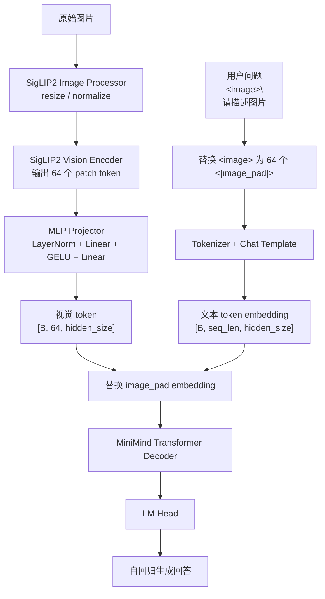
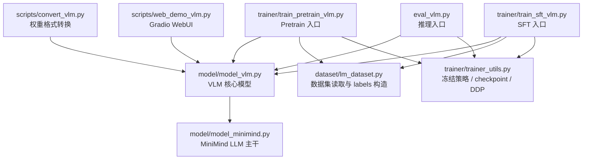
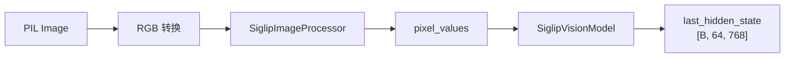
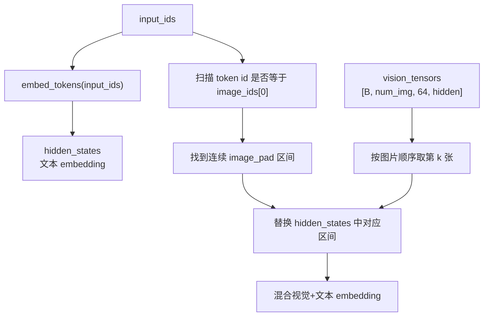
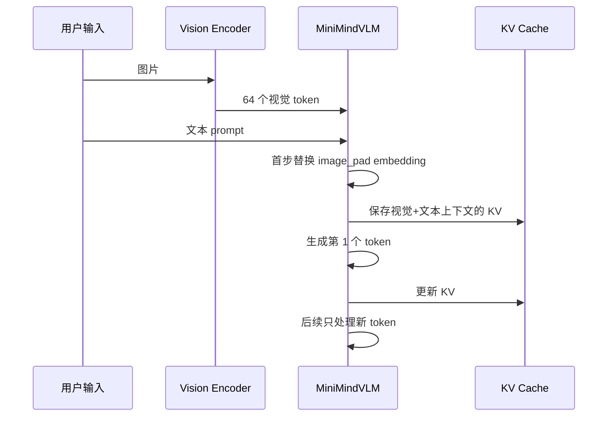
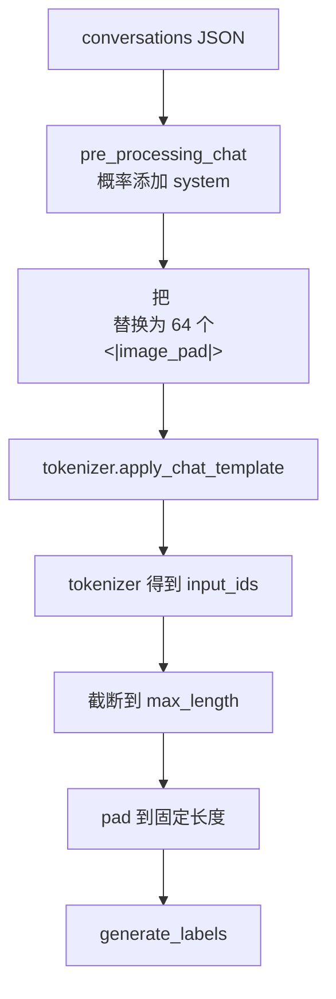
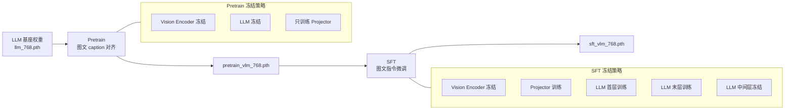
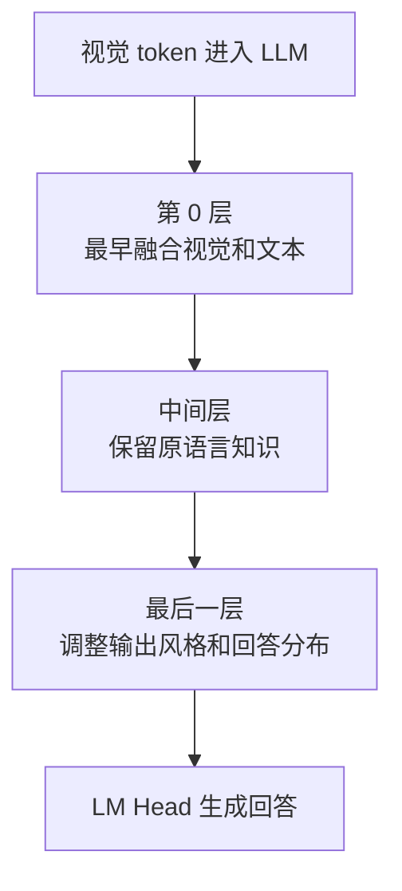
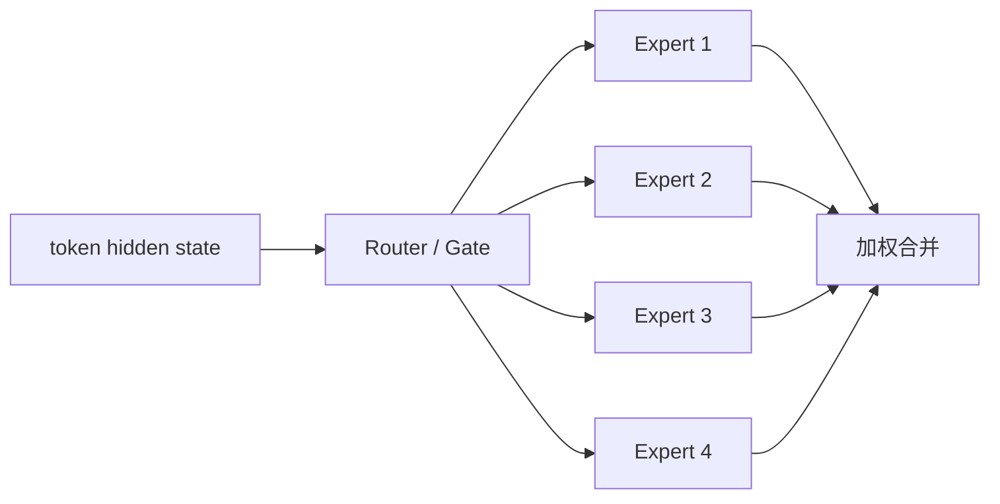
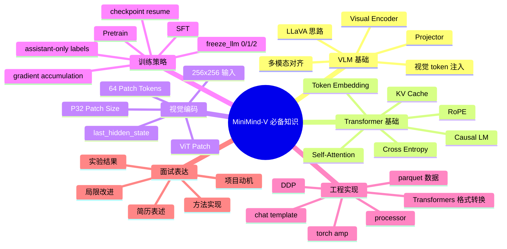

# MiniMind-V 项目掌握与面试手册

> 目标：把 MiniMind-V 讲成一个你真正参与过、能写进简历、能应对多模态大模型实习面试追问的项目。本文不以“完整训练复现”为核心，而以“流程理解、代码逻辑、数学原理、面试表达”为核心。

## 0. 你最终要能讲出的版本

### 30 秒版本

我参与了一个轻量级视觉语言模型 MiniMind-V 的复现与代码解析工作。项目参考 LLaVA 的多模态对齐思路，用冻结的 SigLIP2 视觉编码器提取图像 patch token，再通过两层 MLP Projector 把视觉特征映射到 MiniMind 语言模型的 hidden space，并替换文本序列中的 `<|image_pad|>` 占位 token，使原本的 Causal LM 能处理图像问答。训练上分为 projector-only 的图文对齐阶段和 projector + LLM 首尾层的 SFT 阶段，以较低成本完成图片描述和视觉问答能力。

### 2 分钟版本

这个项目的核心问题是：如何在不重新训练一个大模型的情况下，让一个小型语言模型具备看图回答能力。我的理解是，VLM 的关键不是让 LLM 直接读图片，而是先把图片转成 LLM 能理解的一串 embedding。

具体实现上，项目使用 SigLIP2 作为视觉编码器。输入图片固定 resize 到 256x256，patch size 是 32，所以一张图片会被切成 8x8，也就是 64 个视觉 patch token。然后用一个 `LayerNorm -> Linear -> GELU -> Linear` 的 MLP Projector，把这些 768 维视觉 token 投影到 MiniMind LLM 的 hidden size。文本侧会把 `<image>` 展开成 64 个 `<|image_pad|>`，在模型 forward 时，代码会找到这些占位 token 的 embedding 位置，并用 projector 输出的视觉 embedding 替换掉它们。替换之后，Transformer 看到的就是一条“视觉 token + 文本 token”的混合序列，后续仍按 Causal LM 的方式预测下一个 token。

训练上，Pretrain 阶段默认冻结 LLM 和视觉编码器，只训练 projector，让视觉 token 先对齐到语言空间；SFT 阶段训练 projector 和 LLM 首尾层，让模型学会按指令回答图像问题，同时尽量保留小语言模型原有的语言能力。我主要负责复现项目链路、梳理核心代码、分析数据处理和训练策略，并总结了面试可讲的代码逻辑和技术原理。

## 1. 项目整体流程图



这张图你要背下来的核心句子：

> MiniMind-V 没有改变 Causal LM 的本质，只是在 token embedding 层把图像特征伪装成一段特殊 token，让 Transformer 继续做下一个 token 预测。

## 2. 项目分层架构


### 每层一句话

- 数据层：把图文对话样本组织成模型能训练的 token 和 labels。
- 视觉层：把图片变成一串视觉特征 token。
- 对齐层：把视觉特征映射到语言模型 embedding 空间。
- 语言模型层：像普通 Causal LM 一样预测回答。

## 3. 代码地图：每个文件负责什么



### 必须掌握优先级

| 优先级 | 文件 | 你必须会讲什么 |
|---|---|---|
| P0 | `model/model_vlm.py` | 图片 token 怎么进入 LLM |
| P0 | `dataset/lm_dataset.py` | 图文样本怎么变成 input_ids 和 labels |
| P0 | `trainer/trainer_utils.py` | 冻结策略、权重加载、checkpoint |
| P1 | `trainer/train_sft_vlm.py` | SFT 训练 step、loss、梯度更新 |
| P1 | `trainer/train_pretrain_vlm.py` | projector-only pretrain |
| P1 | `eval_vlm.py` | 推理时 prompt 和 pixel_values 怎么进模型 |
| P2 | `model/model_minimind.py` | Transformer、Attention、RoPE、MoE 基础 |

## 4. 核心代码逻辑拆解

### 4.1 `VLMConfig`：多模态配置

位置：`model/model_vlm.py`

核心字段：

```python
image_special_token = '<|image_pad|>'
image_ids = [12]
image_hidden_size = 768
image_token_len = 64
```

你要理解：

- `<image>` 是数据里人类可读的图像占位符。
- `<|image_pad|>` 是 tokenizer 真正能编码的特殊 token。
- 一张图片会对应 64 个 `<|image_pad|>`。
- `image_ids=[12]` 表示 `<|image_pad|>` 在 tokenizer 里的 token id 是 12。

面试表达：

> 配置里最关键的是 `image_token_len=64` 和 `image_ids`。前者决定一张图需要多少个占位 token，后者让 forward 能在 input_ids 里定位这些位置，再用视觉 embedding 替换掉原文本 embedding。

### 4.2 `MMVisionProjector`：视觉到语言的翻译器

代码结构：

```python
self.mlp = nn.Sequential(
    nn.LayerNorm(in_dim),
    nn.Linear(in_dim, out_dim),
    nn.GELU(),
    nn.Linear(out_dim, out_dim),
)
```

数学表达：

设视觉编码器输出为：

```text
V ∈ R^{B x 64 x d_v}
```

其中：

- `B` 是 batch size
- `64` 是图像 patch token 数量
- `d_v=768` 是 SigLIP2 输出维度

Projector 做的是：

```text
Z = W2 * GELU(W1 * LN(V) + b1) + b2
Z ∈ R^{B x 64 x d_l}
```

如果 LLM hidden size 也是 768，那么形状不变，但语义空间发生了变化。

你要讲清楚：

> 即使视觉特征和文本 embedding 维度相同，也不能直接塞给 LLM，因为两个模型学到的表示空间不同。Projector 学的是一个跨模态映射，让视觉 token 更像 LLM 能理解的 token embedding。

### 4.3 `get_vision_model`：加载并冻结 SigLIP2

关键逻辑：

```python
model = SiglipVisionModel.from_pretrained(model_path)
processor = SiglipImageProcessor.from_pretrained(model_path)
for param in model.parameters():
    param.requires_grad = False
return model.eval(), processor
```

为什么冻结？

- 节省显存和训练成本。
- 避免小规模训练破坏视觉 encoder 的通用视觉能力。
- 这个项目的重点是低成本复现 VLM，对齐层训练已经足够展示核心思路。

面试标准答案：

> 冻结视觉编码器是轻量 VLM 常见策略。视觉 encoder 已经在大规模图文数据上学到较好的视觉表示，小项目没必要重新训练它。我们只需要训练 projector，让视觉特征适配 LLM 的 hidden space。

### 4.4 `image2tensor` 和 `get_image_embeddings`

流程图：



关键点：

- RGBA/LA 图片会先转 RGB。
- processor 做 resize、normalize、tensor 化。
- `with torch.no_grad()` 因为 vision encoder 冻结。
- 返回 `last_hidden_state`，不是最终 pooled embedding。

为什么不用 pooled embedding？

> pooled embedding 只有一个全局向量，细节太少；VLM 需要保留空间 patch 信息，所以用 64 个 patch token，让 LLM 能看到更细粒度的图像区域特征。

### 4.5 `count_vision_proj`：最关键的图像注入逻辑

这是 MiniMind-V 的灵魂函数。

它做的事：

1. 遍历 input_ids。
2. 找到连续的 `<|image_pad|>` token。
3. 拿对应图片的 64 个视觉 embedding。
4. 替换这段 token embedding。
5. 返回混合后的 hidden states。

可视化：

```text
替换前：
[BOS] [user] [<|image_pad|>] [<|image_pad|>] ... x64 ... [问题 token]
          │         │                 │
          └── 普通 token embedding ───┘

替换后：
[BOS] [user] [visual_1] [visual_2] ... [visual_64] [问题 token]
```

Mermaid 版：



面试官如果问“图像和文本怎么融合？”：

> 融合发生在 embedding 层，而不是 attention 层单独加 cross-attention。代码先计算文本 token embedding，然后把 image pad token 对应的位置替换成视觉 projector 输出。这样后续 Transformer self-attention 会自然地在视觉 token 和文本 token 之间建立联系。

### 4.6 `forward`：为什么只在 `start_pos == 0` 注入图片？

推理时是自回归生成：

```text
第 1 步：输入完整 prompt，包括 64 个视觉 token + 文本问题
第 2 步：只输入上一步生成的新 token，同时使用 KV cache
第 3 步：继续只输入新 token
```

图示：



标准答案：

> 因为生成时第一步已经把图像 token 编进上下文，并保存到 KV cache 里了。后续每生成一个 token，只需要处理新 token。如果每一步都重新注入图像，不仅浪费计算，还可能和 KV cache 的位置对不上。

## 5. 数据处理逻辑

### 5.1 parquet 数据格式

每条样本主要包含：

```text
conversations: JSON string
image_bytes: binary 或 binary list
```

例子：

```json
[
  {"role": "user", "content": "<image>\n请描述这张图片。"},
  {"role": "assistant", "content": "这张图片展示了..."}
]
```

### 5.2 训练输入怎么构造？



### 5.3 labels 为什么只监督 assistant？

训练 Causal LM 时，模型本质是预测下一个 token。

如果 input 是：

```text
user: 图片里有什么？
assistant: 图片里有一只狗。
```

我们只希望模型学习 assistant 部分，而不是学习复述 user prompt。

所以 labels 大致是：

```text
input_ids: [user tokens........ assistant tokens........ pad]
labels:    [-100 -100 -100..... assistant tokens........ -100]
```

数学上：

```text
Loss = - Σ log P(y_t | x_{<t})
```

但只有 `labels[t] != -100` 的位置参与求和。

标准答案：

> `-100` 是 PyTorch cross entropy 的 ignore index。prompt 部分设置为 `-100`，可以让模型只学习回答，而不是学习预测用户输入和 system prompt。

## 6. 训练流程

### 6.1 两阶段训练图



### 6.2 `freeze_llm` 三种模式

| 参数 | 含义 | 适用场景 | 风险 |
|---|---|---|---|
| `0` | 除 vision encoder 外全训 | 大数据、大算力 | 小模型容易遗忘语言能力 |
| `1` | projector + LLM 首尾层 | SFT 默认 | 能力提升有限但稳 |
| `2` | 只训 projector | Pretrain 默认 | LLM 不适配复杂指令 |

### 6.3 为什么 Pretrain 只训 projector？

Pretrain 数据多是图片描述，目标是让模型先知道视觉 token 大概对应什么语义。如果这时就动 LLM，可能会破坏语言模型原有能力。

类比：

> Pretrain 是先训练一个“图片到语言的翻译器”，不是重新训练语言模型。

### 6.4 为什么 SFT 训练首尾层？



标准答案：

> 首层负责接收视觉 token 后的早期融合，末层直接影响生成分布和回答风格。中间层冻结是为了保留小语言模型原本的语言能力，避免 SFT 数据把它冲坏。

## 7. 数学原理与八股知识

### 7.1 Causal LM 是什么？

Causal LM 的目标是根据前面的 token 预测下一个 token：

```text
P(x_1, x_2, ..., x_T) = Π P(x_t | x_<t)
```

训练 loss：

```text
L = - Σ log P(x_t | x_<t)
```

浅显解释：

> 模型每次只做一件事：根据已经看到的内容猜下一个 token。看图问答也没有改变这个本质，只是“已经看到的内容”里多了视觉 token。

### 7.2 Embedding 是什么？

token id 本身只是整数，没有语义。Embedding 层把 token id 查表变成向量：

```text
token_id -> embedding vector
```

VLM 的关键是：

```text
文本 token -> 文本 embedding
图片 patch -> 视觉 embedding -> projector -> LLM embedding space
```

### 7.3 Self-Attention 在 VLM 里做什么？

替换后，序列里同时有视觉 token 和文本 token：

```text
[visual_1, ..., visual_64, question_1, ..., question_n]
```

Self-Attention 会让文本 token attend 到视觉 token，从而回答图片问题。

简化公式：

```text
Attention(Q, K, V) = softmax(QK^T / sqrt(d)) V
```

浅显解释：

> Attention 就是在问：当前 token 应该从前面哪些 token 里拿信息。图片 token 被放进同一条序列后，问题 token 和回答 token 就可以从图片 token 里取信息。

### 7.4 RoPE 是什么？

RoPE 是 Rotary Position Embedding，用来给 Transformer 注入位置信息。

你不需要推导细节，但要会说：

> Transformer self-attention 本身不天然知道 token 顺序，RoPE 通过旋转 query/key 向量的方式编码相对位置信息，使模型能区分第 1 个 token 和第 100 个 token。

### 7.5 MoE 是什么？

MoE 是 Mixture of Experts，把 FFN 替换成多个 expert，每个 token 只路由到部分 expert。



MiniMind-V 里：

- dense 版本参数少，结构简单。
- MoE 版本总参数更多，但每个 token 激活的 expert 少，激活参数量相对可控。
- `aux_loss` 用来鼓励路由更均衡，避免所有 token 都挤到一个 expert。

### 7.6 SigLIP / CLIP 类视觉编码器是什么？

CLIP/SigLIP 这类模型通过图文对比学习，让图片和文本在同一个语义空间里接近。

MiniMind-V 不训练 SigLIP2，只借用它的视觉表示能力。

标准答案：

> SigLIP2 在这里相当于一个通用视觉特征提取器，它把图片切成 patch 并输出视觉 token。MiniMind-V 用它的 encoder 输出，而不是最终分类或 pooled 表示。

### 7.7 Projector 和 Q-Former 有什么区别？

| 方案 | 代表 | 特点 |
|---|---|---|
| Linear Projector | LLaVA-1 | 简单、便宜 |
| MLP Projector | LLaVA-1.5 / MiniMind-V | 表达力更强，仍然简单 |
| Q-Former | BLIP-2 | 用 learnable query 从视觉特征里抽取信息，更复杂 |

标准答案：

> MiniMind-V 选择 MLP Projector 是为了保持项目极简和低成本。它比单层 Linear 表达能力强，又比 Q-Former 简单，适合教学和小模型复现。

## 8. 面试官可能追问的问题与标准答案

### A. 项目背景类

#### Q1：你为什么做这个项目？

标准答案：

> 我想系统理解 VLM 是怎么从 LLM 扩展出来的。相比直接调用 Qwen-VL 或 GPT-4V，MiniMind-V 代码更小，能完整看到图片预处理、视觉编码、跨模态投影、训练 labels、冻结策略和推理生成的全链路，所以适合作为多模态大模型入门和课题组复现项目。

面试官想考：

> 你是不是只是跑了 demo，还是理解为什么选这个项目。

补一句：

> 我关注的重点不是模型规模，而是 VLM 最小闭环：visual encoder + projector + LLM。

#### Q2：这个项目解决了什么问题？

标准答案：

> 它解决的是低成本构建视觉语言模型的问题。通过冻结已有视觉编码器和语言模型，只训练一个 projector 以及少量 LLM 层，就能让小语言模型具备基础图片描述和视觉问答能力。

### B. 架构类

#### Q3：MiniMind-V 的核心结构是什么？

标准答案：

> 三部分：SigLIP2 视觉编码器、MLP Projector、MiniMind Causal LM。视觉编码器负责把图像变成 64 个 patch token，Projector 把视觉 token 映射到 LLM hidden space，LLM 负责基于混合 token 序列生成回答。

#### Q4：图像和文本在哪里融合？

标准答案：

> 在 embedding 层融合。文本先通过 token embedding 得到 hidden states，图像经过 vision encoder 和 projector 得到视觉 hidden states，然后代码用视觉 hidden states 替换 `<|image_pad|>` 对应位置。后续 Transformer self-attention 会统一处理视觉和文本 token。

#### Q5：为什么不用 cross-attention？

标准答案：

> Cross-attention 需要额外模块，结构更复杂。MiniMind-V 采用 LLaVA 类的简单方案，把视觉 token 直接拼进 LLM token 序列，让原有 self-attention 完成跨模态交互，迁移成本更低。

### C. 代码类

#### Q6：`count_vision_proj` 在干什么？

标准答案：

> 它扫描 input_ids，找到连续的 `<|image_pad|>` token 区间，然后用对应图片的 projector 输出替换这些位置的文本 embedding。这个函数就是图像进入 LLM 的关键入口。

#### Q7：`labels=-100` 是什么意思？

标准答案：

> `-100` 是 cross entropy 的忽略标记。训练聊天模型时，user 和 system 部分不应该被预测，所以设成 `-100`；assistant 回复部分保留真实 token id，用来计算 loss。

#### Q8：推理时为什么要把 `<image>` 替换成 64 个 `<|image_pad|>`？

标准答案：

> 因为模型并不认识原始 `<image>` 文本，它训练时看到的是 64 个 `<|image_pad|>`。这 64 个占位 token 对应 64 个视觉 patch token。如果推理不按同样方式展开，模型就找不到视觉 embedding 应该替换的位置。

#### Q9：为什么 `forward` 里判断 `start_pos == 0`？

标准答案：

> 自回归生成第一步会处理完整 prompt，包括视觉 token；之后生成时使用 KV cache，只处理新生成 token。图像上下文已经缓存在 KV cache 里，所以后续不需要重复编码和注入图片。

### D. 训练类

#### Q10：Pretrain 和 SFT 有什么区别？

标准答案：

> Pretrain 主要做基础图文对齐，通常用 caption 数据，默认只训练 projector。SFT 用图文指令数据，让模型学习如何根据图片回答用户问题，默认训练 projector 和 LLM 首尾层。

#### Q11：为什么不全参微调？

标准答案：

> MiniMind 的语言主干比较小，全参微调容易被图文数据冲掉原来的语言能力，而且训练成本更高。只训练 projector 和首尾层是一个低成本折中：既能适配视觉输入，又能保留中间层语言知识。

#### Q12：训练 loss 是怎么来的？

标准答案：

> 模型仍然是 Causal LM loss。输入是视觉 token 和文本 token 的混合序列，labels 只保留 assistant 回复部分。模型在每个 assistant token 位置预测下一个 token，用 cross entropy 计算 loss；MoE 版本还会加一个 router auxiliary loss。

### E. 数据类

#### Q13：训练数据是什么格式？

标准答案：

> 数据用 parquet 存储，每条样本包含 conversations 和 image_bytes。conversations 是多轮对话 JSON，image_bytes 是图片二进制。Dataset 里会把 `<image>` 展开为 64 个 `<|image_pad|>`，并把 image_bytes 解码成 PIL 图片交给 SigLIP processor。

#### Q14：纯文本数据为什么也要混进去？

标准答案：

> 纯文本数据能帮助模型保持原有语言能力。因为 VLM SFT 大部分是图文任务，如果完全没有纯文本样本，小模型可能更容易遗忘通用对话能力。

### F. 评估与局限类

#### Q15：这个模型效果怎么样？

标准答案：

> 它能完成基础主体识别和图片描述，但细节容易有幻觉，长回答会重复。原因包括模型规模小、输入分辨率固定为 256x256、视觉 token 数有限、训练策略偏低成本。

#### Q16：如果让你改进，你会怎么做？

标准答案：

> 我会从四方面改：第一，引入动态分辨率或 tile-based encoding，提升细节理解；第二，换更强的视觉 encoder；第三，使用更强的 LLM 底座；第四，加入更系统的 benchmark，比如 MME、MMBench、POPE 等，量化评估幻觉和视觉问答能力。

### G. 深挖类

#### Q17：为什么一张图是 64 个 token？

标准答案：

> 输入图像是 256x256，SigLIP2 的 patch size 是 32，所以高和宽各切成 8 个 patch，总共 8x8=64 个 patch token。

#### Q18：Projector 输出 token 和文本 token 是拼接还是替换？

标准答案：

> 实现上是替换。文本序列里先放 64 个 `<|image_pad|>` 占位 token，得到 embedding 后，再用视觉 projector 输出替换这些位置。效果上等价于把视觉 token 插入到文本序列对应位置。

#### Q19：为什么不用最终图像 embedding，而用 last_hidden_state？

标准答案：

> 最终 pooled embedding 是全局表示，只有一个向量，容易丢失局部细节。last_hidden_state 保留每个 patch 的特征，更适合视觉问答和细粒度描述。

#### Q20：MoE 版本为什么总参数更多但激活参数可控？

标准答案：

> MoE 有多个 expert，所以总参数变多；但每个 token 只会被 router 分配到少数 expert，比如 top-1 或 top-k，因此单次前向实际激活的参数少于总参数。

## 9. 面试模拟：一轮完整对话

### 面试官：你介绍一下这个项目。

回答：

> 这个项目是一个轻量级 VLM 的复现和解析工作，目标是理解如何把纯语言模型扩展成视觉语言模型。整体结构参考 LLaVA，用 SigLIP2 作为冻结视觉编码器，把图片转成 64 个 patch token，再用两层 MLP Projector 映射到 MiniMind LLM 的 hidden space。文本里的 `<image>` 会被展开成 64 个 `<|image_pad|>`，forward 时用视觉 token 替换这些位置的 embedding，之后 Transformer 按普通 Causal LM 方式生成回答。我主要梳理了数据处理、图像注入、训练冻结策略和推理链路。

### 面试官：你说的“图像注入”具体在代码哪里？

回答：

> 在 `model/model_vlm.py` 的 `count_vision_proj`。它会扫描 input_ids，找到 token id 等于 `image_ids[0]` 的连续区间，也就是 64 个 `<|image_pad|>`，然后用 `vision_proj` 输出的视觉 embedding 替换这段 hidden states。这个替换发生在进入 Transformer layers 之前。

### 面试官：为什么不把图片转成文字 caption 再给 LLM？

回答：

> caption 是一种间接方案，会丢失很多细节，而且受 caption 模型限制。MiniMind-V 是端到端地把视觉 patch token 放进 LLM 序列，让模型在生成时可以直接 attend 到视觉 token，信息保留更充分。

### 面试官：你们训练了哪些参数？

回答：

> 视觉编码器全程冻结。Pretrain 阶段默认只训练 projector；SFT 阶段训练 projector 和 LLM 的第 0 层、最后一层，中间层冻结。这是为了在小模型上平衡图文适配和语言能力保留。

### 面试官：loss 怎么算？

回答：

> 还是标准 Causal LM cross entropy。Dataset 构造 labels 时，system 和 user 部分设为 `-100`，assistant 回复部分保留 token id。模型 forward 里把 logits 和 labels shift 一位，用当前位置预测下一个 token。MoE 版本额外加 router auxiliary loss。

### 面试官：你觉得这个项目最大的不足是什么？

回答：

> 主要是模型小、固定分辨率、评估不够系统。固定 256x256 和 64 个视觉 token 对细节理解有限，小 LLM 也限制了复杂推理能力。后续我会考虑动态分辨率、tile encoding、更强底座和标准 benchmark。

## 10. 你必须掌握的知识点清单



### 八股速记表

| 知识点 | 标准答案 |
|---|---|
| VLM 核心 | 把图片变成视觉 token，并映射到 LLM hidden space，与文本 token 一起输入 Transformer |
| Visual Encoder | 提取图像 patch 特征，MiniMind-V 用冻结 SigLIP2 |
| Projector | 跨模态映射，把视觉特征变成 LLM 能理解的 embedding |
| 64 token 来源 | 256x256 / patch size 32 = 8x8 = 64 |
| image pad | 文本中的视觉占位符，后续被视觉 embedding 替换 |
| assistant-only loss | 只训练模型回答，不训练它复述用户输入 |
| `-100` | cross entropy ignore index |
| Pretrain | 先训练 projector 做图文基础对齐 |
| SFT | 用图文指令数据训练模型按问题回答 |
| 冻结视觉编码器 | 降低成本，保留预训练视觉能力 |
| 冻结 LLM 中间层 | 避免小模型语言能力遗忘 |
| KV cache | 生成时缓存历史 key/value，后续不用重复处理完整上下文 |
| MoE | 多 expert FFN，每个 token 只激活部分 expert |
| aux loss | 鼓励 MoE 路由负载均衡 |

## 11. 简历内容：任务背景 → 方法/实现 → 实验结果/产出

### 版本 A：稳妥真实版

**任务背景：**  
课题组需要复现并理解轻量级视觉语言模型 MiniMind-V，用于掌握 VLM 从语言模型扩展到图文理解的核心链路，并形成可解释的训练与推理分析材料。

**方法/实现：**  
基于 SigLIP2 视觉编码器和 MiniMind Causal LM，梳理并复现了图像 patch token 经 MLP Projector 映射到 LLM hidden space 的多模态对齐流程；分析 `<image>` 展开为 64 个 `<|image_pad|>` 后在 embedding 层被视觉 token 替换的实现逻辑；整理 parquet 图文数据读取、assistant-only loss 构造、projector-only pretrain 与 projector + LLM 首尾层 SFT 的低成本训练策略，并对核心源码添加中文注释。

**实验结果/产出：**  
完成 MiniMind-V 推理链路验证和核心代码解析文档，输出项目流程图、训练阶段图、张量流图、面试问答清单和简历材料；能够解释视觉编码器冻结、MLP Projector 对齐、image token 注入、Causal LM loss、KV cache 推理等关键技术点。

### 版本 B：偏工程能力版

**任务背景：**  
围绕多模态大模型实习方向，参与课题组轻量 VLM 项目 MiniMind-V 的复现与源码解析，目标是在有限算力下理解视觉语言模型的最小实现闭环。

**方法/实现：**  
使用冻结 SigLIP2 提取 256x256 图像的 64 个 patch token，通过 `LayerNorm + Linear + GELU + Linear` 的 MLP Projector 对齐到 MiniMind LLM hidden space；在模型 forward 中定位连续 `<|image_pad|>` token，并用视觉 embedding 替换文本 embedding，实现视觉信息注入；梳理 Pretrain/SFT 两阶段训练脚本、参数冻结策略、checkpoint/resume 机制和 Transformers 权重转换流程。

**实验结果/产出：**  
完成 dense 版本推理流程验证，整理 6 个核心源码文件的中文注释和一份系统化技术手册；沉淀多模态对齐、Causal LM 训练目标、视觉 token 注入、MoE 路由与低成本微调策略等面试知识点。

### 版本 C：更像正式项目经历版

**MiniMind-V 轻量视觉语言模型复现与解析**  

- **任务背景：** 面向课题组多模态大模型研究需求，复现轻量级 VLM MiniMind-V，理解 LLaVA 类视觉指令微调范式在小模型上的实现方式。
- **方法/实现：** 基于冻结 SigLIP2 视觉编码器提取 64 个图像 patch token，设计两层 MLP Projector 将视觉特征对齐至 MiniMind LLM hidden space；通过替换 `<|image_pad|>` token embedding 实现图文 token 融合；分析并整理 projector-only pretrain、projector + LLM 首尾层 SFT、assistant-only loss 和 KV cache 推理机制。
- **实验结果/产出：** 跑通 MiniMind-V 推理链路，完成核心源码中文注释、项目流程图、训练/推理链路图和面试问答手册；总结模型局限与改进方向，包括动态分辨率、tile-based encoding、更强视觉 encoder 和标准化多模态 benchmark。

### 简历避免踩坑

不要写：

```text
独立提出 MiniMind-V 模型
```

除非你真的是原作者。

建议写：

```text
参与课题组 MiniMind-V 复现、源码解析与训练/推理链路梳理
```

或者：

```text
基于 MiniMind-V 开源框架完成轻量 VLM 复现与原理分析
```

## 12. 你应该如何学习这份文档

### 第 1 天：讲清整体流程

目标：能讲 30 秒版本和 2 分钟版本。

重点看：

- 第 1 节流程图
- 第 2 节架构
- 第 11 节简历版本

### 第 2 天：读懂代码

目标：能解释 4 个核心函数：

- `MMVisionProjector`
- `get_image_embeddings`
- `count_vision_proj`
- `generate_labels`

### 第 3 天：背熟八股

目标：能回答：

- 为什么 64 个 token？
- 为什么冻结 vision encoder？
- 为什么只训首尾层？
- labels 为什么是 `-100`？
- loss 怎么算？

### 第 4 天：模拟面试

目标：让别人按第 8 节和第 9 节问你，你能不看文档回答。

### 第 5 天：补充提升点

目标：能讲项目局限和改进方向。

必须会说：

- 动态分辨率
- tile-based encoding
- 更强 LLM 底座
- 更强视觉 encoder
- 标准 benchmark
- 幻觉评估

## 13. 最终背诵版

你可以把下面这段背熟：

> MiniMind-V 是一个轻量级 VLM 项目，我参与的重点是复现和理解它的多模态对齐链路。它用冻结的 SigLIP2 把 256x256 图片编码成 64 个 patch token，再用两层 MLP Projector 把视觉特征映射到 MiniMind LLM 的 hidden space。文本里 `<image>` 会展开成 64 个 `<|image_pad|>`，forward 时模型扫描这些 token id，并用视觉 embedding 替换对应位置的文本 embedding。之后 Transformer 通过 self-attention 在视觉 token 和文本 token 之间交互，最后按 Causal LM 的方式生成回答。训练上 Pretrain 只训 projector 做基础图文对齐，SFT 训练 projector 和 LLM 首尾层，避免小模型全参微调导致语言能力遗忘。我理解这个项目的价值在于它用很少的代码展示了 VLM 的最小闭环：视觉编码、跨模态投影、token 注入、指令微调和自回归生成。
