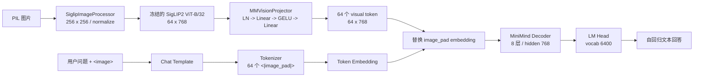
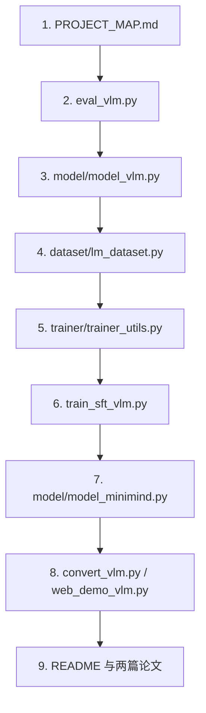
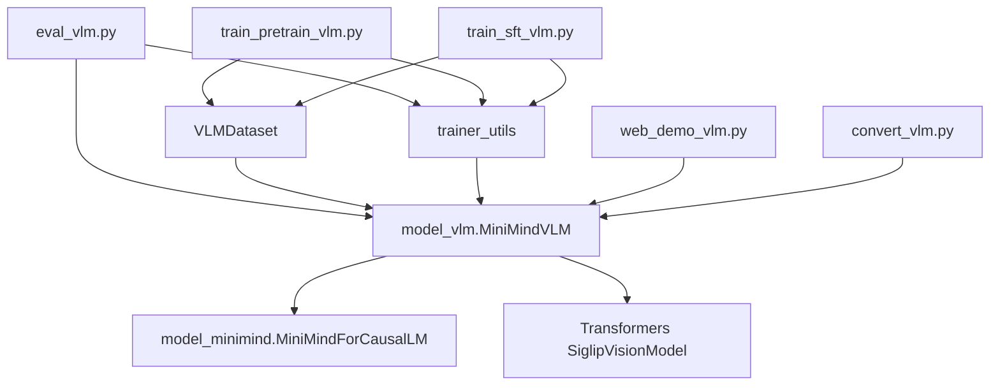

# MiniMind-V 仓库地图

## 1. 项目定位

MiniMind-V 解决的核心问题是：**如何用尽可能少的新增结构和可训练参数，把一个纯文本自回归语言模型扩展成能看图回答的视觉语言模型。**

它采用 LLaVA 类路线，不额外引入 cross-attention：冻结 SigLIP2 视觉编码器，用两层 MLP Projector 把图像 patch 特征投影到 LLM hidden space，再替换文本序列中 `<|image_pad|>` 的 embedding。此后，视觉 token 与文本 token 一起进入原有 decoder-only Transformer。

技术领域与应用场景：

- 视觉语言模型（VLM）与多模态大模型入门。
- 图片描述、视觉问答、轻量图文指令微调。
- 小模型、低成本训练与个人 GPU 推理。
- 教学、源码解析、VLM 结构原型验证。

不应误解为：

- 不是严格意义上的“所有参数从随机初始化开始”。README 在 `README.md:342` 明确说明 LLM 使用已有 MiniMind 权重。
- 不是高分辨率、多图、多轮、视频、视觉定位的完整生产系统。
- 不是带标准 benchmark 测试套件的成熟研究框架。

## 2. 一眼看懂架构



代码落点：

- 视觉编码与融合：`model/model_vlm.py:45` 的 `MiniMindVLM`。
- 语言模型：`model/model_minimind.py:234` 的 `MiniMindForCausalLM`。
- 数据构造：`dataset/lm_dataset.py:50` 的 `VLMDataset`。
- 推理入口：`eval_vlm.py:35` 的 `main`。
- 训练入口：`trainer/train_pretrain_vlm.py:96`、`trainer/train_sft_vlm.py:96`。

## 3. 目录与文件职责

```text
MiniMind-V/
├── model/                  # LLM、VLM、tokenizer、外部视觉编码器
├── dataset/                # parquet Dataset 与 6 张推理样图
├── trainer/                # Pretrain、SFT、DDP、冻结与 checkpoint
├── scripts/                # Transformers 权重转换和 Gradio WebUI
├── images/                 # README 架构图、loss 曲线和演示素材
├── papers/                 # LLaVA / LLaVA-1.5 参考论文
├── out/                    # 本地原生 PyTorch 权重；已被 gitignore
├── eval_vlm.py             # 最小端到端命令行 demo
├── requirements.txt        # 依赖清单
├── README.md               # 官方中文说明
└── MiniMind-V 项目掌握与面试手册.md
```

### `model/`

| 文件 | 职责 | 重点 |
|---|---|---|
| `model_minimind.py` | decoder-only LLM | RMSNorm、GQA、RoPE、SwiGLU、MoE、KV cache、sampling |
| `model_vlm.py` | 在 LLM 上增加视觉能力 | SigLIP2、Projector、image pad embedding 替换 |
| `tokenizer.json` | 6400 词表及 tokenization 规则 | 数据文件，通常不手读 |
| `tokenizer_config.json` | special token 与 chat template | `<|image_pad|>` 是 id 12；模板决定训练/推理格式 |
| `model_init.md` | 视觉编码器下载说明 | 运行前置条件 |
| `siglip2-base-p32-256-ve/` | 本地冻结视觉模型 | 约 94.552M 参数；不提交 Git |

### `dataset/`

| 文件/目录 | 职责 |
|---|---|
| `lm_dataset.py` | 读取 parquet、插入 image pad、构造 assistant-only labels、处理图片 |
| `eval_images/` | 6 张命令行推理样图 |
| `pretrain_i2t.parquet` | 可选 caption 对齐数据；本地当前不存在 |
| `sft_i2t.parquet` | 图文 SFT 数据；本地当前不存在 |

### `trainer/`

| 文件 | 职责 | 默认策略 |
|---|---|---|
| `train_pretrain_vlm.py` | projector 对齐训练 | lr `4e-4`，`freeze_llm=2`，max length 450 |
| `train_sft_vlm.py` | 图文指令微调 | lr `5e-6`，`freeze_llm=1`，max length 768 |
| `trainer_utils.py` | DDP、seed、冻结、权重加载、checkpoint、collate、续训 sampler | 训练公共基础设施 |

### `scripts/`

| 文件 | 职责 | 限制 |
|---|---|---|
| `convert_vlm.py` | 原生 `.pth` 与 Transformers 目录互转 | `__main__` 硬编码为 MoE 与相对路径 |
| `web_demo_vlm.py` | 扫描 Transformers 模型目录并启动 Gradio | 不直接识别 `out/*.pth`；UI 历史未进入模型 prompt |

## 4. 入口文件

| 场景 | 入口 | 主函数/接口 | 从哪里运行 |
|---|---|---|---|
| 原生权重命令行推理 | `eval_vlm.py` | `main()` | 仓库根目录 |
| Projector Pretrain | `trainer/train_pretrain_vlm.py` | `train_epoch()` + `__main__` | 建议进入 `trainer/` 后运行 |
| 图文 SFT | `trainer/train_sft_vlm.py` | `train_epoch()` + `__main__` | 建议进入 `trainer/` 后运行 |
| 数据预览 | `dataset/lm_dataset.py` | `__main__` | 进入 `dataset/` 且 parquet 已下载 |
| WebUI | `scripts/web_demo_vlm.py` | `launch_gradio_server()` | 进入 `scripts/`，且存在 Transformers 格式模型目录 |
| 权重转换 | `scripts/convert_vlm.py` | `convert_torch2transformers_minimind()` | 进入 `scripts/` 或显式修正路径 |

最可靠的当前 demo：

```powershell
python eval_vlm.py `
  --load_from model `
  --weight sft_vlm `
  --max_new_tokens 32 `
  --image_dir .\dataset\eval_images `
  --device cuda
```

## 5. 关键依赖

### 核心运行依赖

- `torch`：张量、模型、训练、CUDA、DDP。
- `transformers==4.57.6`：Tokenizer、SigLIP2、PreTrainedModel 接口。
- `Pillow`：图片读取与 RGB 转换。
- `pyarrow`：parquet 数据读取。

### 训练与工程依赖

- `datasets`：训练脚本导入，但当前主链路没有直接调用其 API。
- `swanlab` / `wandb`：可选实验追踪。
- `gradio`：WebUI。
- `modelscope`：模型和数据下载工具，未写入当前 `requirements.txt` 主体。

### 依赖清单的现实情况

`requirements.txt` 包含大量来自更大 MiniMind 生态的依赖，例如 Flask、OpenAI、PEFT、TRL、Streamlit、sentence-transformers。阅读 MiniMind-V 核心模型时可暂时忽略它们。当前全局环境执行 `pip check` 有多组冲突，因此推荐使用独立 Python 3.10 环境。

## 6. 配置文件与配置入口

| 配置 | 位置 | 影响 |
|---|---|---|
| LLM hidden/layers/heads/MoE | `MiniMindConfig`，`model_minimind.py:10` | 模型容量和计算量 |
| image token/id/length | `VLMConfig`，`model_vlm.py:13` | 视觉 token 的定位与数量 |
| tokenizer/chat template | `model/tokenizer_config.json` | prompt 格式、special token、思考标签 |
| SigLIP2 image/patch size | `model/siglip2-base-p32-256-ve/config.json` | 256 输入、P32、64 patch token |
| 训练超参数 | 两个 `train_*_vlm.py` 的 argparse | batch、lr、冻结、dtype、保存频率 |
| 推理采样 | `eval_vlm.py:43-49` | max tokens、temperature、top-p、thinking |

项目不依赖 `.env` 文件。DDP 的 `RANK`、`LOCAL_RANK` 等由 `torchrun` 自动注入；`TOKENIZERS_PARALLELISM=false` 在 `dataset/lm_dataset.py:15` 内部设置。

## 7. 测试、示例和文档入口

### 测试现状

- 没有 `tests/` 目录。
- 没有 pytest/unittest 配置。
- `dataset/lm_dataset.py:138` 是数据可视化脚本，不是回归测试。
- 当前可用验证层级：语法编译、组件 shape 断言、label mask 断言、冻结参数断言、CLI 端到端推理。

### 示例位置

- `dataset/eval_images/`：6 张图片。
- `eval_vlm.py`：固定 prompt 的批量图片描述 demo。
- `scripts/web_demo_vlm.py`：交互式单轮图片问答。

### 文档入口

1. `PROJECT_MAP.md`：先建立全局地图。
2. `FIRST_PRINCIPLES.md`：理解模型为什么成立。
3. `EXECUTION_TRACE.md`：跟踪一次真实推理。
4. `MODULE_NOTES.md`：逐模块深入与练习。
5. `EXPERIMENT_LOG.md`：查看哪些结论实际运行过。
6. `MiniMind-V 项目掌握与面试手册.md`：面试口述和标准答案。
7. `README.md`：官方使用说明和数据背景。

## 8. 推荐阅读顺序



为什么这样排：

- 先从可运行的业务闭环建立因果链，再下钻 Transformer 细节。
- `model_minimind.py` 很重要，但先读它容易陷入 Attention 数学，忘记项目真正的多模态增量只有 Vision Encoder、Projector 和 embedding 替换。
- 转换与 WebUI 是外围工程，不应抢占核心学习时间。

## 9. 暂时可以跳过

- `CODE_OF_CONDUCT.md`、`LICENSE`：工程治理，不影响模型理解。
- `README_en.md`：与中文 README 内容重复。
- `model/tokenizer.json`：大型 tokenizer 数据；先读 `tokenizer_config.json`。
- `images/` 中宣传和演示素材：需要理解图时再看。
- `scripts/convert_vlm.py`：在你理解原生权重后再看。
- `scripts/web_demo_vlm.py` 的 CSS：与模型无关。
- `requirements.txt` 中非核心依赖的业务用途：不必逐个学习。
- MoE 路由实现：先掌握 dense 主链路，再进入高级部分。

## 10. 核心模块依赖图



## 11. 从零实现最小版本必须保留什么

必须保留：

1. 能产生 patch token 的视觉编码器。
2. 把视觉维度映射到 LLM hidden size 的 Projector。
3. tokenizer 中稳定的 image placeholder。
4. 把视觉 embedding 注入文本序列的融合函数。
5. decoder-only LLM 与 next-token loss/generation。
6. 训练时只监督 assistant 回复的 label mask。

可以先删掉：

- MoE。
- DDP、SwanLab、断点续训。
- WebUI 与 Transformers 格式转换。
- 多图支持。
- YaRN 长上下文扩展。

最小实现的边界是：给一张图片和一句问题，输出一个文本回答，并能用一条图文样本计算有限的 Causal LM loss。
